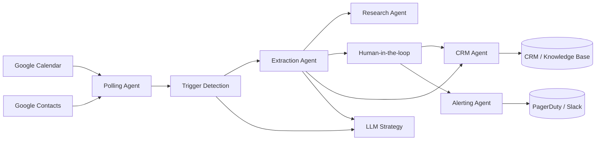

# Agentic Intelligence Research

Agentic Intelligence Research is a modular toolkit for building agent-based process automation workflows. The components focus on orchestrating calendar-driven business processes, collecting the necessary context, requesting human confirmation when required, and handing off curated events to downstream systems such as CRMs or knowledge bases.

The repository is organised as a set of focused agents, supporting utilities, and integration helpers that can be combined to automate a variety of follow-up tasks after calendar events are created.

## Table of contents

1. [Quick start](#quick-start)
2. [System architecture](#system-architecture)
3. [Agent responsibilities](#agent-responsibilities)
4. [Configuration](#configuration)
5. [Running the orchestrator](#running-the-orchestrator)
6. [Repository structure](#repository-structure)
7. [Development workflow](#development-workflow)
8. [Logging and observability](#logging-and-observability)
9. [Data handling and compliance](#data-handling-and-compliance)
10. [Human-in-the-loop interactions](#human-in-the-loop-interactions)
11. [Further reading](#further-reading)

## Quick start

1. **Create a Python environment**
   ```bash
   python -m venv .venv
   source .venv/bin/activate  # On Windows use: .venv\Scripts\activate
   ```

2. **Install dependencies**
   ```bash
   pip install -r requirements.txt
   ```

## System architecture

The automation stack is composed of loosely coupled agents orchestrated by `MasterWorkflowAgent`. A high-level flowchart illustrates the journey from calendar events to CRM updates:



See [`docs/architecture.md`](docs/architecture.md) for deeper component diagrams, deployment guidance, and extension patterns.

## Agent responsibilities

| Agent | Role | Notes |
|-------|------|-------|
| Polling | Collects candidate events and enriches them with organiser contact data. | Uses Google Workspace integrations with configurable lookback windows. |
| Trigger detection | Scores events against hard/soft triggers and LLM heuristics. | Combines deterministic keyword matching with LLM confidence thresholds. |
| Extraction | Builds structured dossiers from event metadata. | Outputs completeness signals used by downstream agents. |
| LLM strategy | Provides reusable prompts, retry budgets, and guardrails for trigger/extraction agents. | Configured via environment variables and prompt templates. |
| Research | Augments dossiers with external context (company intel, notes). | Optional enrichment step feeding back into human review. |
| Human-in-the-loop | Coordinates manual review when information is missing or approvals are required. | Supports strict masking policies for compliance-sensitive deployments. |
| CRM dispatch | Sends curated dossiers to CRM or ticketing systems. | Default implementation logs payloads; replace with production connector. |
| Alerting | Escalates workflow anomalies and compliance breaches. | Integrates with Slack, PagerDuty, or email via pluggable dispatchers. |

Review [`agents/README.md`](agents/README.md) for factory usage and implementation tips on creating new agent variants.

## Configuration

All configuration is driven through environment variables or a `.env` file. The [`config/README.md`](config/README.md) file describes every supported setting, including Google OAuth credentials, local log storage paths, and optional trigger word overrides.

| Category | Key variables | Purpose |
|----------|---------------|---------|
| Google Workspace | `GOOGLE_CLIENT_ID`, `GOOGLE_CLIENT_SECRET`, `GOOGLE_REFRESH_TOKEN`, `GOOGLE_CALENDAR_ID` | Authenticate and scope polling access. |
| Polling windows | `CAL_LOOKAHEAD_DAYS`, `CAL_LOOKBACK_DAYS` | Control how far ahead/behind to query events. |
| LLM guardrails | `LLM_CONFIDENCE_THRESHOLD_*`, `LLM_COST_CAP_*`, `LLM_RETRY_BUDGET_*` | Tune prompt behaviour and spending limits. |
| Compliance | `COMPLIANCE_MODE`, `MASK_PII_IN_LOGS`, `MASK_PII_IN_MESSAGES`, `PII_FIELD_WHITELIST` | Define masking policies and audit posture. |
| Storage | `LOG_STORAGE_DIR`, `EVENT_LOG_DIR`, `WORKFLOW_LOG_DIR`, `RUN_LOG_DIR` | Choose where structured artefacts are written. |
| Agent overrides | `POLLING_AGENT`, `TRIGGER_AGENT`, `EXTRACTION_AGENT`, `HUMAN_AGENT`, `CRM_AGENT` | Swap default implementations via the agent factory. |

The configuration reference includes additional options for rate limits, cost caps, and structured YAML overrides when using `AGENT_CONFIG_FILE`.

## Running the orchestrator

The orchestrator wires the agents together and coordinates polling, enrichment, and escalation flows:

```bash
python -m agents.workflow_orchestrator
```

Individual agents can also be instantiated and exercised directly for targeted tests or integrations.

## Repository structure

- **[`agents/`](agents/README.md):** Core workflow agents for polling, trigger detection, extraction, human-in-the-loop coordination, local persistence, and orchestration.
- **[`docs/`](docs/architecture.md):** Living architecture, compliance, and CI documentation.
- **[`integration/`](integration/README.md):** Google Calendar and Google Contacts API integrations, including OAuth token handling.
- **[`config/`](config/README.md):** Centralised configuration loader and trigger word resources.
- **[`logs/`](logs/README.md):** Structured event/workflow logging backed by the local filesystem.
- **[`log_storage/`](log_storage/README.md):** Default on-disk location for generated event and workflow logs.
- **[`utils/`](utils/README.md):** Cross-cutting utilities for text normalisation, trigger loading, and duplicate detection.
- **[`templates/`](templates/README.md):** Shared communication templates (emails, notifications).
- **[`extraction/`](extraction/README.md):** Extension point for advanced data extraction pipelines.
- **[`human_in_the_loop/`](human_in_the_loop/README.md):** Modules dedicated to manual review, approval, and confirmation flows.
- **[`polling/`](polling/README.md):** Scheduling and trigger polling concepts that feed the automation workflows.
- **[`reminders/`](reminders/README.md):** Reminder and escalation helpers built on top of the email agent.
- **[`tests/`](tests/README.md):** Automated test suite covering core agents, integrations, and utilities.
- **[`ARCHIVE/`](ARCHIVE/Readme.md):** Legacy experiments and retired setup scripts retained for reference.

## Development workflow

1. **Implement automation logic** within the relevant agent or module.
2. **Update configuration defaults** in `config/config.py` and document any new variables.
3. **Add templates or logging helpers** as required.
4. **Extend or write tests** in `tests/` to capture the expected behaviour.
5. **Run the test suite** (see `tests/README.md`) before opening a pull request.

## Logging and observability

Every workflow execution now receives a globally unique **run ID** that is injected into logs, audit artefacts, and OpenTelemetry spans. When tailing `polling_trigger.log` files or centralised logging backends you can search for `run_id=<value>` to correlate events across agents.

Dedicated log managers in [`logs/`](logs/README.md) persist event and workflow logs on the local filesystem. Generated log artefacts default to [`log_storage/run_history`](log_storage/README.md), keeping them out of the repository root. The `MasterWorkflowAgent` exposes a `finalize_run_logs` helper that the orchestrator calls after each run to record log metadata.

In addition to structured logs the orchestrator emits OpenTelemetry metrics and traces:

- `workflow_runs_total` – labelled by success/failure/skipped run status.
- `workflow_trigger_matches_total` – trigger detections grouped by trigger type.
- `workflow_hitl_outcomes_total` – HITL request outcomes (`dossier` vs. `missing_info`).
- `workflow_operation_duration_ms` – histogram covering run-level, trigger, extraction, HITL, and CRM latencies.

Traces are exported with spans for the overall run (`workflow.run`) and each sub-operation (e.g. `workflow.trigger_detection`, `workflow.crm_dispatch`). All spans carry the same `workflow.run_id` attribute, making it straightforward to correlate telemetry with filesystem logs or downstream incident tooling.

### Deployment guidance

Telemetry exporters default to the OTLP/gRPC protocol and honour the standard OpenTelemetry environment variables. To stream metrics and traces to a local collector:

```bash
docker run --rm -p 4317:4317 -p 4318:4318 otel/opentelemetry-collector:latest
```

Then start the orchestrator with the OTLP endpoint configured (the collector listens on `4317` by default):

```bash
export OTEL_EXPORTER_OTLP_ENDPOINT=http://localhost:4317
python -m agents.workflow_orchestrator
```

For production deployments, point `OTEL_EXPORTER_OTLP_ENDPOINT` (and, if required, `OTEL_EXPORTER_OTLP_HEADERS`) at your chosen backend such as Grafana Tempo, Honeycomb, Datadog, or a Prometheus Pushgateway that fronts an OTLP collector. The instrumentation uses a batch span processor and periodic metric reader by default, so no additional configuration is required unless you need to adjust export intervals.

## Data handling and compliance

The platform masks sensitive organiser or attendee information before it is logged or shared with human reviewers. The [`utils/pii.py`](utils/pii.py) module provides the `mask_pii` helper used across agents to redact emails, phone numbers, personal names, and similar identifiers while preserving whitelisted business context such as `company_name` or `web_domain`.

Key guidelines:

- **Never log raw PII.** Agents call `mask_pii` before logging events, trigger results, or human-response details. When adding new logging statements that include user-provided payloads, wrap them with the helper (e.g., `logger.info("Payload: %s", mask_pii(payload))`).
- **Sanitise human-facing messages when compliance mode requires it.** The `HumanInLoopAgent` automatically redacts personal fields before composing confirmation requests when `settings.mask_pii_in_messages` is enabled.
- **Tune compliance by configuration.** Environment variables control how aggressive the masking is:
  - `COMPLIANCE_MODE` accepts `standard` (default) or `strict`. Strict mode enables message masking and expands numeric redaction.
  - `MASK_PII_IN_LOGS` and `MASK_PII_IN_MESSAGES` provide explicit toggles when a deployment needs to override the mode defaults.
  - `PII_FIELD_WHITELIST` lets you append additional business-safe fields (comma-separated) that should never be redacted.

Automated tests under [`tests/test_pii_masking.py`](tests/test_pii_masking.py) assert that masked logs never leak organiser emails and that human-facing messages honour the compliance toggles. Any new features that surface event data should include equivalent safeguards. For a comprehensive control checklist, consult [`docs/compliance.md`](docs/compliance.md).

## Human-in-the-loop interactions

Human feedback is requested through the `HumanInLoopAgent`, which can work with a pluggable communication backend (email, Slack, etc.) or fall back to simulated responses. The [`human_in_the_loop/`](human_in_the_loop/README.md) directory documents patterns for custom manual review steps.

## Further reading

- Detailed agent responsibilities and extension guidance: [`agents/README.md`](agents/README.md)
- Google integrations and credential requirements: [`integration/README.md`](integration/README.md)
- Architecture, deployment, and CI notes: [`docs/architecture.md`](docs/architecture.md)
- Compliance guardrails and audit expectations: [`docs/compliance.md`](docs/compliance.md)
- Testing guidance: [`tests/README.md`](tests/README.md)

Contributions are welcome—please open issues or pull requests with proposed improvements or bug fixes.
