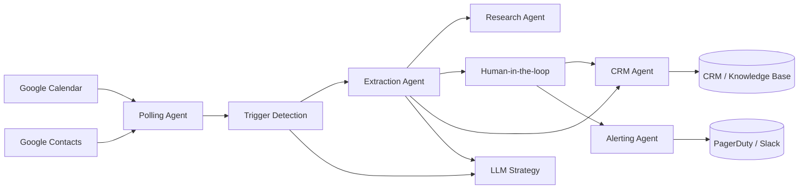

# Agentic Intelligence Research

Agentic Intelligence Research is a modular toolkit for building agent-based process automation workflows. The components focus on orchestrating calendar-driven business processes, collecting the necessary context, requesting human confirmation when required, and handing off curated events to downstream systems such as CRMs or knowledge bases.

The repository is organised as a set of focused agents, supporting utilities, and integration helpers that can be combined to automate a variety of follow-up tasks after calendar events are created.

## Table of contents

1. [Quick start](#quick-start)
2. [System architecture](#system-architecture)
3. [Agent responsibilities](#agent-responsibilities)
4. [Research workflow reference](#research-workflow-reference)
5. [Configuration](#configuration)
6. [Running the orchestrator](#running-the-orchestrator)
7. [Repository structure](#repository-structure)
8. [Development workflow](#development-workflow)
9. [Logging and observability](#logging-and-observability)
10. [Data handling and compliance](#data-handling-and-compliance)
11. [Human-in-the-loop interactions](#human-in-the-loop-interactions)
12. [Further reading](#further-reading)

## Quick start

1. **Create a Python environment**
   ```bash
   python -m venv .venv
   source .venv/bin/activate  # On Windows use: .venv\Scripts\activate
   ```

2. **Install dependencies**
   ```bash
   pip install -r requirements.txt
   ```

## System architecture

The automation stack is composed of loosely coupled agents orchestrated by `MasterWorkflowAgent`. A high-level flowchart illustrates the journey from calendar events to CRM updates:



See [`docs/architecture.md`](docs/architecture.md) for deeper component diagrams, deployment guidance, and extension patterns, including a sequence view of how the research agents collaborate with polling, extraction, and human decision points.

## Agent responsibilities

| Agent | Role | Notes |
|-------|------|-------|
| Polling | Collects candidate events and enriches them with organiser contact data. | Uses Google Workspace integrations with configurable lookback windows. |
| Trigger detection | Scores events against hard/soft triggers and LLM heuristics. | Combines deterministic keyword matching with LLM confidence thresholds. |
| Extraction | Builds structured dossiers from event metadata. | Outputs completeness signals used by downstream agents. |
| LLM strategy | Provides reusable prompts, retry budgets, and guardrails for trigger/extraction agents. | Configured via environment variables and prompt templates. |
| Research | Augments dossiers with external context (company intel, notes). | Composed of dedicated internal, dossier, and similar-company agents that coordinate storage, reminders, and downstream delivery. |
| Human-in-the-loop | Coordinates manual review when information is missing or approvals are required. | Supports strict masking policies for compliance-sensitive deployments. |
| CRM dispatch | Sends curated dossiers to CRM or ticketing systems. | Default implementation logs payloads; replace with production connector. |
| Alerting | Escalates workflow anomalies and compliance breaches. | Integrates with Slack, PagerDuty, or email via pluggable dispatchers. |

Review [`agents/README.md`](agents/README.md) for factory usage and implementation tips on creating new agent variants, including the specialised research agents.

## Research workflow reference

### End-to-end research pipeline

The research pipeline activates after extraction has produced a minimally viable dossier. The orchestrator performs the following stages:

1. **Normalisation** – `MasterWorkflowAgent` harmonises extracted event data into the canonical research input schema (company name, website, organiser emails, trigger metadata).
2. **Internal dossier lookup** – `InternalResearchAgent` checks local artefact storage for an existing dossier, correlates the request with CRM records, and records whether reminders or escalations are needed. When an up-to-date dossier is found the run short-circuits to delivery.
3. **Dossier research generation** – `DossierResearchAgent` queries public sources to create a `company_detail_research.json` artefact that captures background, funding, product signals, and CRM-ready notes. It writes the JSON under `<RESEARCH_ARTIFACT_DIR>/dossier_research/<run_id>/` and emits structured telemetry.
4. **Similar companies analysis** – The `similar_companies_level1` research agent expands on the dossier by identifying comparable organisations and records its findings in `similar_companies_level1.json`.
5. **PDF compilation** – When all required JSON artefacts exist, `utils.reporting.convert_research_artifacts_to_pdfs` packages them into run-scoped PDFs stored beneath `<RESEARCH_PDF_DIR>/<run_id>/`. These PDFs are later attached to CRM records or emailed directly.
6. **Delivery orchestration** – The orchestrator shares the assembled artefacts with the CRM agent and human operator notifications so everyone has a consistent view of the research bundle.

Each stage logs its own progress with the workflow `run_id`, allowing teams to audit the full pipeline across logs, artefacts, and OpenTelemetry traces.

### Existing dossier branch logic

When an organiser or company already has a vetted dossier, the internal research agent reuses the latest artefacts instead of performing a fresh crawl. The decision tree is:

1. Check `<RESEARCH_ARTIFACT_DIR>/internal_research/<company_slug>/latest.json` (or CRM records) for a dossier created within the freshness window.
2. If present, copy the artefact metadata into the current run folder, record a "reuse" decision, and trigger the **existing dossier** email template so operators know why no new research was generated.
3. If the dossier is stale, queue a refresh task by notifying the human-in-the-loop agent. The reminder schedule is derived from the `reminders/` configuration so escalations are automatic when operators do not acknowledge the refresh.
4. Only if no dossier exists (or a refresh is approved) do the dossier and similar-company agents proceed with new research runs.

This logic prevents duplicate research while ensuring operators receive a clear audit trail about what happened in each run.

### Human-in-the-loop decision cycle

The human agent receives structured payloads that include:

- Extracted company facts and detected research gaps.
- Any prior dossier metadata (timestamps, owning researcher, status).
- Suggested follow-up actions from the internal research agent (e.g. "confirm organiser website" or "approve refresh").

The cycle progresses through the following checkpoints:

1. **Assignment** – The orchestrator records an audit log entry (`research.internal_research`) and assigns the task. Reminder timers start immediately.
2. **Reminder and escalation** – If the task remains incomplete, reminders are sent using `reminders/` cadences (for example, 2-hour and 6-hour follow-ups) until the SLA is met. Escalations are logged with the same `run_id` for traceability.
3. **Decision capture** – Operators respond via the configured human backend (email, ticketing, or chat). Their choices (approve, request changes, decline) are persisted to the audit trail under `log_storage/run_history/workflows/<run_id>/hitl.json`.
4. **Audit stitching** – Once the human decision is applied, the orchestrator updates the run record with timestamps, the acting operator, and a summary of the action so downstream audits can replay the decision path.

### Final research delivery workflow

Every run ends by compiling the artefacts required for organisers and CRM stakeholders:

1. **PDF attachments** – The reporting utility generates a concise PDF summary for each JSON artefact and stores it at `<RESEARCH_PDF_DIR>/<run_id>/<artifact_name>.pdf`. The CRM agent attaches these files when sending the final research dossier.
2. **CRM portal links** – When `CRM_ATTACHMENT_BASE_URL` is configured, each artefact path is converted into a stable link (for example, `https://crm.example.com/attachments/<run_id>/<file>`). Operators will see these links referenced in CRM notes and the final delivery email.
3. **Email delivery** – The `final_research_delivery` templates include both PDF attachments and portal links so organisers have immediate access regardless of channel restrictions.
4. **Run closure** – `MasterWorkflowAgent.finalize_run_logs` records the artefact manifest, HITL outcomes, and delivery status. Operators can cross-check the manifest in `log_storage/run_history/research/workflow_runs/<run_id>/summary.json`.

See [`docs/research_artifacts.md`](docs/research_artifacts.md) for detailed artefact schemas, sample JSON files, and PDF layout guidance that operators can use when validating deliveries.

## Configuration

All configuration is driven through environment variables or a `.env` file. The [`config/README.md`](config/README.md) file describes every supported setting, including Google OAuth credentials, local log storage paths, and optional trigger word overrides.

| Category | Key variables | Purpose |
|----------|---------------|---------|
| Google Workspace | `GOOGLE_CLIENT_ID`, `GOOGLE_CLIENT_SECRET`, `GOOGLE_REFRESH_TOKEN`, `GOOGLE_CALENDAR_ID` | Authenticate and scope polling access. |
| Polling windows | `CAL_LOOKAHEAD_DAYS`, `CAL_LOOKBACK_DAYS` | Control how far ahead/behind to query events. |
| LLM guardrails | `LLM_CONFIDENCE_THRESHOLD_*`, `LLM_COST_CAP_*`, `LLM_RETRY_BUDGET_*` | Tune prompt behaviour and spending limits. |
| Compliance | `COMPLIANCE_MODE`, `MASK_PII_IN_LOGS`, `MASK_PII_IN_MESSAGES`, `PII_FIELD_WHITELIST` | Define masking policies and audit posture. |
| Storage | `LOG_STORAGE_DIR`, `EVENT_LOG_DIR`, `WORKFLOW_LOG_DIR`, `RUN_LOG_DIR`, `AGENT_LOG_DIR`, `RESEARCH_ARTIFACT_DIR`, `RESEARCH_PDF_DIR` | Choose where structured artefacts, research notes, PDFs, and supporting files are written. |
| Research agents | `AGENT_CONFIG_FILE` overrides for `internal_research`, `dossier_research`, and `similar_companies` | Select alternative research implementations, including sandbox/test doubles. |
| CRM attachments | `CRM_ATTACHMENT_BASE_URL`, `HUBSPOT_API_BASE_URL` | Prefix CRM-friendly links to stored dossiers and configure the base URL for HubSpot API calls. |
| PDF generation | `RESEARCH_PDF_DIR`, `REPORTLAB` dependency | Control where research PDFs are stored and ensure ReportLab is installed for PDF generation. |
| Agent overrides | `POLLING_AGENT`, `TRIGGER_AGENT`, `EXTRACTION_AGENT`, `HUMAN_AGENT`, `CRM_AGENT` | Swap default implementations via the agent factory. |

The configuration reference includes additional options for rate limits, cost caps, structured YAML overrides when using `AGENT_CONFIG_FILE`, plus controls for research artefact storage, CRM attachment link construction, and custom research agent selection.

## Running the orchestrator

The orchestrator wires the agents together and coordinates polling, enrichment, and escalation flows:

```bash
python -m agents.workflow_orchestrator
```

> **Async orchestration:** The workflow now runs fully asynchronously. Compose agents via their coroutine interfaces and avoid introducing synchronous adapter layers.

Refer to [`docs/lifecycle.md`](docs/lifecycle.md) for a detailed look at startup, cooperative cancellation, and graceful shutdown sequencing within the orchestrator.

Individual agents can also be instantiated and exercised directly for targeted tests or integrations.

## Repository structure

- **[`agents/`](agents/README.md):** Core workflow agents for polling, trigger detection, extraction, human-in-the-loop coordination, local persistence, and orchestration.
- **[`docs/`](docs/architecture.md):** Living architecture, compliance, and CI documentation.
- **[`integration/`](integration/README.md):** Google Calendar and Google Contacts API integrations, including OAuth token handling.
- **[`config/`](config/README.md):** Centralised configuration loader and trigger word resources.
- **[`logs/`](logs/README.md):** Structured event/workflow logging backed by the local filesystem.
- **[`log_storage/`](log_storage/README.md):** Default on-disk location for generated event and workflow logs.
- **[`utils/`](utils/README.md):** Cross-cutting utilities for text normalisation, trigger loading, and duplicate detection.
- **[`templates/`](templates/README.md):** Shared communication templates (emails, notifications).
- **[`extraction/`](extraction/README.md):** Extension point for advanced data extraction pipelines.
- **[`human_in_the_loop/`](human_in_the_loop/README.md):** Modules dedicated to manual review, approval, and confirmation flows.
- **[`polling/`](polling/README.md):** Scheduling and trigger polling concepts that feed the automation workflows.
- **[`reminders/`](reminders/README.md):** Reminder and escalation helpers built on top of the email agent.
- **[`tests/`](tests/README.md):** Automated test suite covering core agents, integrations, and utilities.
- **[`ARCHIVE/`](ARCHIVE/Readme.md):** Legacy experiments and retired setup scripts retained for reference.

## Development workflow

1. **Implement automation logic** within the relevant agent or module.
2. **Update configuration defaults** in `config/config.py` and document any new variables.
3. **Add templates or logging helpers** as required.
4. **Extend or write tests** in `tests/` to capture the expected behaviour.
5. **Run the test suite** (see `tests/README.md`) before opening a pull request.

## Logging and observability

Every workflow execution now receives a globally unique **run ID** that is injected into logs, audit artefacts, and OpenTelemetry spans. The identifier is generated inside `main.py` immediately after environment validation and is passed into the `WorkflowOrchestrator`; no component is allowed to create a fallback run ID. When tailing `polling_trigger.log` files or centralised logging backends you can search for `run_id=<value>` to correlate events across agents.

Dedicated log managers in [`logs/`](logs/README.md) persist event and workflow logs on the local filesystem. Generated log artefacts default to [`log_storage/run_history`](log_storage/README.md), keeping them out of the repository root. The `MasterWorkflowAgent` exposes a `finalize_run_logs` helper that the orchestrator calls after each run to record log metadata.

In addition to structured logs the orchestrator emits OpenTelemetry metrics and traces when an OTLP endpoint is configured:

- `workflow_runs_total` – labelled by success/failure/skipped run status.
- `workflow_trigger_matches_total` – trigger detections grouped by trigger type.
- `workflow_hitl_outcomes_total` – HITL request outcomes (`dossier` vs. `missing_info`).
- `workflow_operation_duration_ms` – histogram covering run-level, trigger, extraction, HITL, and CRM latencies.

Traces are exported with spans for the overall run (`workflow.run`) and each sub-operation (e.g. `workflow.trigger_detection`, `workflow.crm_dispatch`). All spans carry the same `workflow.run_id` attribute, making it straightforward to correlate telemetry with filesystem logs or downstream incident tooling.

### Deployment guidance

Telemetry exporters default to the OTLP/gRPC protocol and honour the standard OpenTelemetry environment variables. The lightweight bootstrap in `main.py` only enables telemetry when one of `OTEL_EXPORTER_OTLP_ENDPOINT`, `OTEL_EXPORTER_OTLP_TRACES_ENDPOINT`, or `OTEL_EXPORTER_OTLP_METRICS_ENDPOINT` is defined. To stream traces to the local OpenTelemetry Collector that is bundled with this repository, start the docker-compose stack (the collector reads the config in [`observability/otel/collector-config.yml`](observability/otel/collector-config.yml)):

```bash
docker compose up otel-collector
```

The application container already exports traces to the Collector via HTTP (`/v1/traces`) using the default port `4318`. When running the orchestrator or other local scripts outside of Docker, point `OTEL_EXPORTER_OTLP_ENDPOINT` at the collector service:

```bash
export OTEL_EXPORTER_OTLP_ENDPOINT=http://otel-collector:4318
python -m agents.workflow_orchestrator
```

For production deployments, point `OTEL_EXPORTER_OTLP_ENDPOINT` (and, if required, `OTEL_EXPORTER_OTLP_HEADERS`) at your chosen backend such as Grafana Tempo, Honeycomb, Datadog, or a Prometheus Pushgateway that fronts an OTLP collector. The instrumentation uses a batch span processor and periodic metric reader by default, so no additional configuration is required unless you need to adjust export intervals.

## Data handling and compliance

The platform masks sensitive organiser or attendee information before it is logged or shared with human reviewers. The [`utils/pii.py`](utils/pii.py) module provides the `mask_pii` helper used across agents to redact emails, phone numbers, personal names, and similar identifiers while preserving whitelisted business context such as `company_name` or `web_domain`.

Key guidelines:

- **Never log raw PII.** Agents call `mask_pii` before logging events, trigger results, or human-response details. When adding new logging statements that include user-provided payloads, wrap them with the helper (e.g., `logger.info("Payload: %s", mask_pii(payload))`).
- **Sanitise human-facing messages when compliance mode requires it.** The `HumanInLoopAgent` automatically redacts personal fields before composing confirmation requests when `settings.mask_pii_in_messages` is enabled.
- **Tune compliance by configuration.** Environment variables control how aggressive the masking is:
  - `COMPLIANCE_MODE` accepts `standard` (default) or `strict`. Strict mode enables message masking and expands numeric redaction.
  - `MASK_PII_IN_LOGS` and `MASK_PII_IN_MESSAGES` provide explicit toggles when a deployment needs to override the mode defaults.
  - `PII_FIELD_WHITELIST` lets you append additional business-safe fields (comma-separated) that should never be redacted.

Automated tests under [`tests/test_pii_masking.py`](tests/test_pii_masking.py) assert that masked logs never leak organiser emails and that human-facing messages honour the compliance toggles. Any new features that surface event data should include equivalent safeguards. For a comprehensive control checklist, consult [`docs/compliance.md`](docs/compliance.md).

## Human-in-the-loop interactions

Human feedback is requested through the `HumanInLoopAgent`, which can work with a pluggable communication backend (email, Slack, etc.). Missing-information flows remain deterministic for local demos, but dossier confirmations now require a configured backend—if one is absent the agent raises an explicit error rather than simulating a decision. The [`human_in_the_loop/`](human_in_the_loop/README.md) directory documents patterns for custom manual review steps.

## Further reading

- Detailed agent responsibilities and extension guidance: [`agents/README.md`](agents/README.md)
- Google integrations and credential requirements: [`integration/README.md`](integration/README.md)
- Architecture, deployment, and CI notes: [`docs/architecture.md`](docs/architecture.md)
- Compliance guardrails and audit expectations: [`docs/compliance.md`](docs/compliance.md)
- Testing guidance: [`tests/README.md`](tests/README.md)

Contributions are welcome—please open issues or pull requests with proposed improvements or bug fixes.
