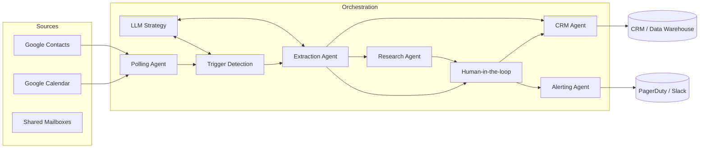
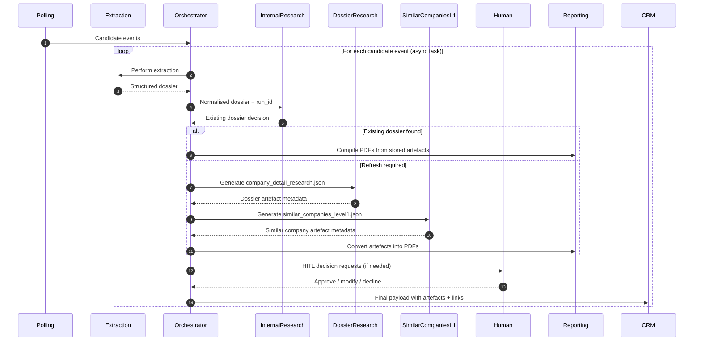
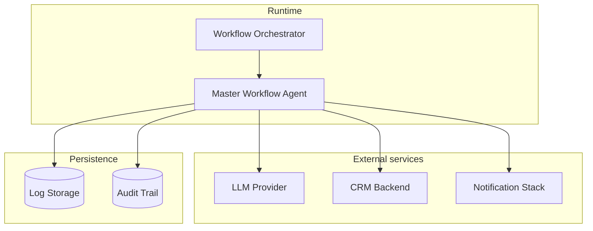

# Architecture overview

The Agentic Intelligence platform is organised around modular agents that collaborate
through a lightweight orchestrator. Each agent owns a focused responsibility, making it
straightforward to replace or extend individual capabilities without rewriting the entire
pipeline.

## High-level component map

## Data flow lifecycle

1. **Polling** retrieves candidate events and associated contacts from Google Workspace
   using the integration adapters.
2. **Trigger detection** analyses each event with deterministic keyword rules and an LLM
   scoring layer to decide whether automation should continue.
3. **Extraction** converts event metadata into structured dossiers, reusing LLM helpers and
   deterministic parsers. Confidence scores accompany each field.
4. **Research** enriches dossiers with public context such as company profiles,
   internal knowledge-base lookups, and similar-company analysis.
5. **Human-in-the-loop** receives tasks for incomplete dossiers, ensuring compliance
   policies are honoured before anything is sent downstream.
6. **CRM dispatch** pushes finalised dossiers into CRM or knowledge systems, recording
   the workflow `run_id` for auditing.
7. **Alerting** escalates anomalies (excessive failures, compliance blocks) to operators via
   Slack or PagerDuty, closing the loop with observability.

The orchestrator stitches these agents together, sharing configuration through the central
`Settings` object and propagating the `run_id` for observability.

## Research agent collaboration

`InternalResearchAgent` always runs first and can short-circuit the pipeline when an existing dossier is valid. When a refresh is required, the orchestrator fans out to `DossierResearchAgent` and the `similar_companies_level1` agent. The reporting utility then turns JSON artefacts into PDFs for distribution.

## Existing dossier reuse and refresh

The internal research agent maintains company-scoped folders in `RESEARCH_ARTIFACT_DIR/internal_research`. Each folder stores the latest dossier manifest with timestamps and ownership metadata. During a workflow run, the agent:

1. Checks the manifest for freshness (default: within the last 30 days) and whether the organiser requested a refresh.
2. If still fresh, copies the manifest into the current run folder (`research/workflow_runs/<run_id>/summary.json`) and logs a `reuse` decision.
3. If stale, posts a refresh task to the human agent. Reminders and escalations are derived from `human_in_the_loop/` and `reminders/` configurations.
4. Once an operator approves, new dossier and similar-company research runs are triggered and the refreshed manifest replaces the historical version.

This approach provides deterministic reuse of prior work while keeping an auditable history of refresh decisions.

## Human-in-the-loop decision architecture

Human reviews are orchestrated through structured messages emitted by `MasterWorkflowAgent`. Each message includes:

- The workflow `run_id` and source agent (`research.internal_research`, `hitl.assignment`, etc.).
- The current dossier status (`existing_dossier`, `refresh_requested`, `missing_research_inputs`).
- A recommended action (`approve_refresh`, `supply_missing_details`, `confirm_delivery`).

Reminder logic is implemented with the `reminders` package:

1. Upon assignment, a timer is scheduled for the first reminder window.
2. If no response is recorded, reminder events escalate through configured channels (email, Slack, PagerDuty).
3. Each reminder updates the audit trail stored under `log_storage/run_history/workflows/<run_id>/hitl.json` with timestamps and escalation levels.
4. A final escalation notifies the alerting agent, ensuring unresolved research requests surface in observability dashboards.

## Research artefact production and delivery

Research agents create JSON artefacts in deterministic locations:

- `internal_research/<run_id>/internal_research.json` – existing dossier manifest, assigned researcher, freshness indicators.
- `dossier_research/<run_id>/company_detail_research.json` – the comprehensive company dossier.
- `similar_companies_level1/<run_id>/similar_companies_level1.json` – comparable company catalogue.

`utils.reporting.convert_research_artifacts_to_pdfs` consumes these JSON documents and writes PDFs to `RESEARCH_PDF_DIR/<run_id>/`. The CRM agent receives both the JSON and PDF paths. When `CRM_ATTACHMENT_BASE_URL` is set, the orchestrator appends stable URLs to the final payload so CRM operators can access artefacts without downloading attachments.

Refer to [`docs/research_artifacts.md`](research_artifacts.md) for full schema references and sample outputs delivered to event organisers.

## Lifecycle & shutdown

All agents now expose asynchronous interfaces and are orchestrated without synchronous bridge adapters. `WorkflowOrchestrator` establishes a single event loop, tracks background tasks spawned by individual agents, and coordinates cooperative cancellation during shutdown. Signal handlers trigger `shutdown()` so long-running awaits are cancelled gracefully, artefact writers flush, and telemetry is finalised before the process exits.

For a deep dive into startup ordering, cancellation semantics, and recommended integration patterns, see [`docs/lifecycle.md`](lifecycle.md).

## Deployment topology

`WorkflowOrchestrator` typically runs as a scheduled container, VM process, or serverless
job. External dependencies (LLM providers, CRM APIs, notification stacks) are defined via
configuration to support different deployments.

## Extension guide

| Extension area | Approach | Key files |
| -------------- | -------- | --------- |
| New polling source | Implement `BasePollingAgent` in `agents/interfaces` and register it via `agents/factory.py`. | [`agents/event_polling_agent.py`](../agents/event_polling_agent.py) |
| Alternative trigger logic | Provide a new `BaseTriggerAgent` implementation or augment the LLM prompts in [`templates/prompts`](../templates/prompts). | [`agents/trigger_detection_agent.py`](../agents/trigger_detection_agent.py) |
| Custom extraction pipeline | Extend `BaseExtractionAgent` and add deterministic or LLM-based enrichment steps. | [`agents/extraction_agent.py`](../agents/extraction_agent.py) |
| Human review UX | Replace `HumanInLoopAgent` with an integration that posts to your preferred ticketing/chat platform. | [`agents/human_in_loop_agent.py`](../agents/human_in_loop_agent.py) |
| Downstream destinations | Swap out `LoggingCrmAgent` for a production CRM connector while reusing shared dossier schemas. | [`agents/crm_agent.py`](../agents/crm_agent.py) |
| Alert policies | Update or replace `AlertingAgent` once added; alerts should emit OpenTelemetry spans and use `utils/notifications`. | [`logs/README.md`](../logs/README.md) |

Refer back to the root [`README.md`](../README.md) for environment bootstrap steps and the
`docs/compliance.md` guide for guardrails that apply to every extension.
