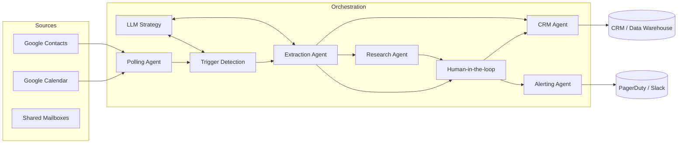
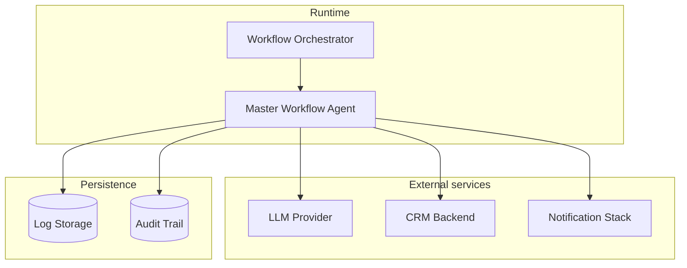

# Architecture overview

The Agentic Intelligence platform is organised around modular agents that collaborate
through a lightweight orchestrator. Each agent owns a focused responsibility, making it
straightforward to replace or extend individual capabilities without rewriting the entire
pipeline.

## High-level component map

## Data flow lifecycle

1. **Polling** retrieves candidate events and associated contacts from Google Workspace
   using the integration adapters.
2. **Trigger detection** analyses each event with deterministic keyword rules and an LLM
   scoring layer to decide whether automation should continue.
3. **Extraction** converts event metadata into structured dossiers, reusing LLM helpers and
   deterministic parsers. Confidence scores accompany each field.
4. **Research** (optional) enriches dossiers with public context such as company profiles
   or industry notes.
5. **Human-in-the-loop** receives tasks for incomplete dossiers, ensuring compliance
   policies are honoured before anything is sent downstream.
6. **CRM dispatch** pushes finalised dossiers into CRM or knowledge systems, recording
   the workflow `run_id` for auditing.
7. **Alerting** escalates anomalies (excessive failures, compliance blocks) to operators via
   Slack or PagerDuty, closing the loop with observability.

The orchestrator stitches these agents together, sharing configuration through the central
`Settings` object and propagating the `run_id` for observability.

## Deployment topology

`WorkflowOrchestrator` typically runs as a scheduled container, VM process, or serverless
job. External dependencies (LLM providers, CRM APIs, notification stacks) are defined via
configuration to support different deployments.

## Extension guide

| Extension area | Approach | Key files |
| -------------- | -------- | --------- |
| New polling source | Implement `BasePollingAgent` in `agents/interfaces` and register it via `agents/factory.py`. | [`agents/event_polling_agent.py`](../agents/event_polling_agent.py) |
| Alternative trigger logic | Provide a new `BaseTriggerAgent` implementation or augment the LLM prompts in [`templates/prompts`](../templates/prompts). | [`agents/trigger_detection_agent.py`](../agents/trigger_detection_agent.py) |
| Custom extraction pipeline | Extend `BaseExtractionAgent` and add deterministic or LLM-based enrichment steps. | [`agents/extraction_agent.py`](../agents/extraction_agent.py) |
| Human review UX | Replace `HumanInLoopAgent` with an integration that posts to your preferred ticketing/chat platform. | [`agents/human_in_loop_agent.py`](../agents/human_in_loop_agent.py) |
| Downstream destinations | Swap out `LoggingCrmAgent` for a production CRM connector while reusing shared dossier schemas. | [`agents/crm_agent.py`](../agents/crm_agent.py) |
| Alert policies | Update or replace `AlertingAgent` once added; alerts should emit OpenTelemetry spans and use `utils/notifications`. | [`logs/README.md`](../logs/README.md) |

Refer back to the root [`README.md`](../README.md) for environment bootstrap steps and the
`docs/compliance.md` guide for guardrails that apply to every extension.
