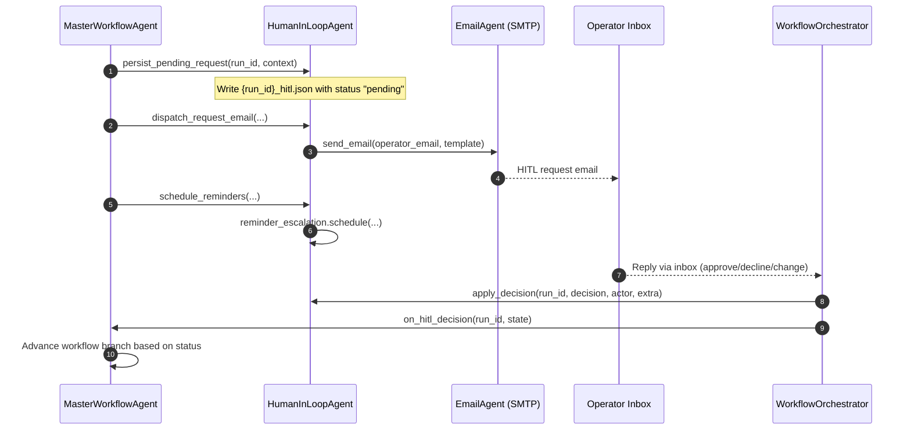
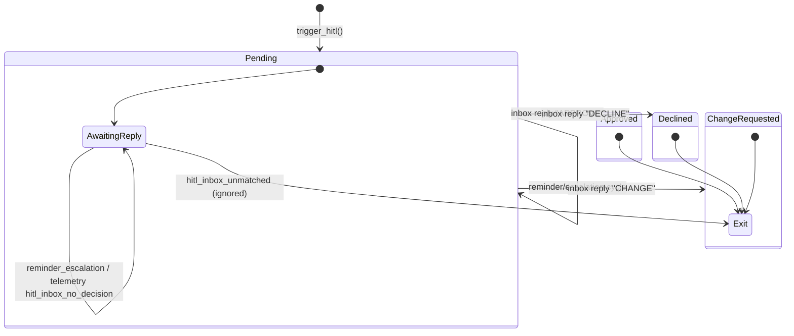

# Human-in-the-Loop Flow

The HITL workflow coordinates persistence, notification, telemetry, and inbox
processing so every request remains pending until an operator explicitly
responds.

## Sequence Overview

## State Transitions & Telemetry

Telemetry events emitted during the flow:

- `hitl_request_sent` – persisted state + email dispatched.
- `hitl_inbox_unmatched` – inbox message without run identifier.
- `hitl_inbox_no_decision` – reply without actionable command.
- `hitl_decision_applied` – parsed decision written back to storage.
- `hitl_approved`, `hitl_change`, `hitl_declined` – workflow branches.
