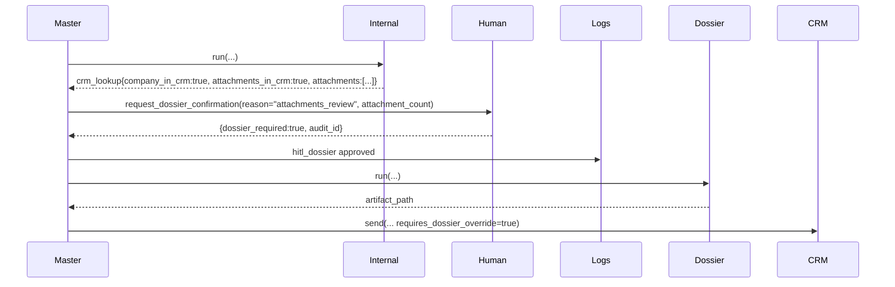
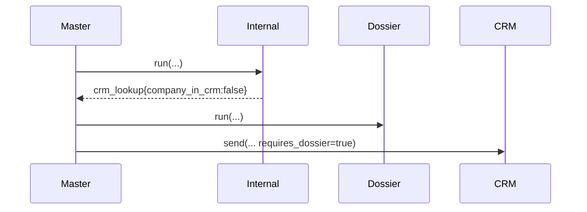
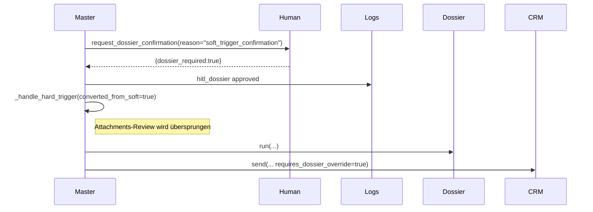
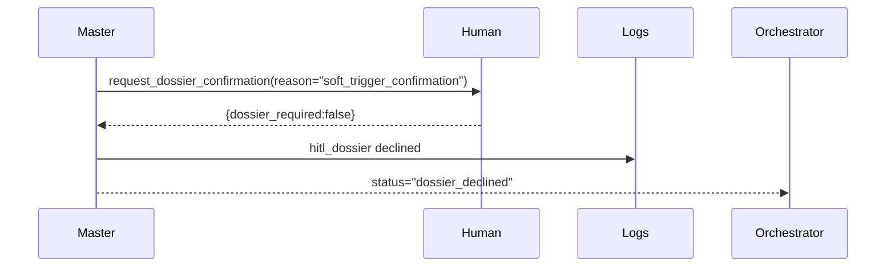
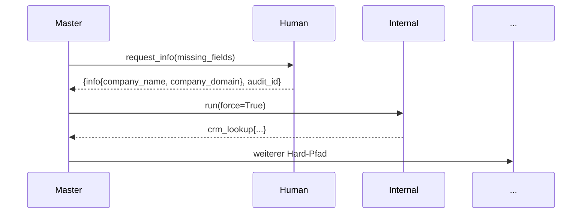
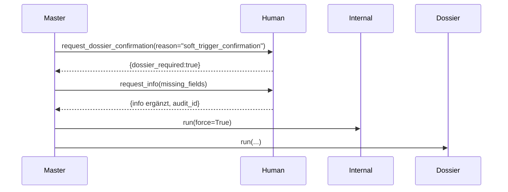
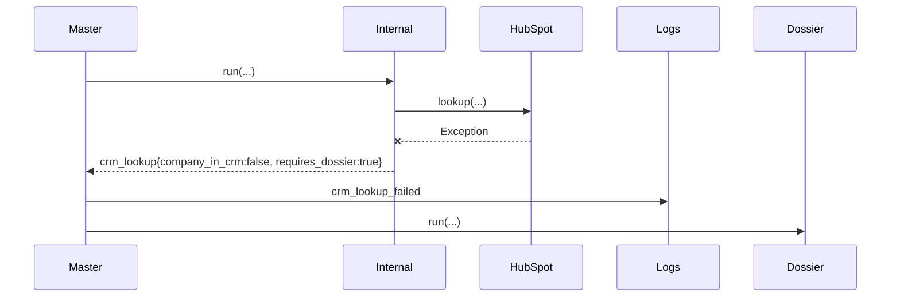

# HubSpot-Dossier-Workflow – Auditbericht

## 1) Executive Summary
- Grundlage der Prüfung war die vom Auftraggeber gelieferte Spezifikation zu HubSpot-basierten Dossier-Entscheidungen; ausgewertet wurden interne Recherche, Master-Workflow, HITL-Kommunikation und Persistenzpfade.【F:agents/internal_research_agent.py†L70-L167】【F:agents/master_workflow_agent.py†L300-L1567】【F:agents/human_in_loop_agent.py†L31-L720】【F:config/config.py†L250-L520】
- Der InternalResearchAgent ruft HubSpot auf, liefert `company_in_crm`/`attachments_in_crm`, legt Nachbarschafts- und Matching-Artefakte im Run-Verzeichnis ab und protokolliert alle Schritte im Workflow-Log – damit erfüllt er Spezifikationspunkt 1 mit robuster Fehlerbehandlung bei Integrationsausfällen.【F:agents/internal_research_agent.py†L54-L167】【F:agents/internal_research_agent.py†L466-L553】
- Der MasterWorkflowAgent differenziert Hard-/Soft-Trigger, führt fehlende Pflichtdaten per HITL nach, stößt bei Attachments eine manuelle Prüfung an und orchestriert Dossier- sowie Similar-Research inklusive CRM-Dispatch; Soft→Hard-Eskalationen überspringen jedoch die geforderte erneute Attachments-Prüfung (DEVIATION).【F:agents/master_workflow_agent.py†L360-L700】【F:agents/master_workflow_agent.py†L1236-L1405】
- HumanInLoopAgent generiert E-Mails mit englischen Textbausteinen, Reminder-Kaskade (4h/24h/48h) und Audit-Logging, deckt aber nicht alle verlangten Platzhalter wie Zeitzone, CRM-Link oder Run-ID ab und nutzt bei fehlenden Company-/Domain-Daten nur generische Rückfragen (GAP).【F:agents/human_in_loop_agent.py†L86-L445】【F:agents/human_in_loop_agent.py†L520-L675】
- Persistenz erfüllt die geforderten Verzeichnisse `log_storage/run_history/...` für Agent-Logs, Research-Artefakte, Workflow-Logs, Cache-Dateien und Run-Index; Orchestrator speichert zusätzlich ein `workflow_runs/<run_id>/summary.json` Manifest.【F:config/config.py†L250-L520】【F:agents/local_storage_agent.py†L65-L106】【F:agents/workflow_orchestrator.py†L611-L637】
- Edge-Cases wie fehlender HubSpot-Zugriff, 429/Timeout, unkonfiguriertes E-Mail-Backend oder fehlende Organizer-Adresse resultieren in defensiven Statuswerten (`crm_lookup_skipped`, `dossier_backend_unavailable`, Reminder-Stopp) – Timeout ohne Antwort bleibt dauerhaft `pending` und benötigt manuelle Nacharbeit (GAP).【F:agents/internal_research_agent.py†L472-L553】【F:integration/hubspot_integration.py†L180-L257】【F:agents/master_workflow_agent.py†L1269-L1319】【F:agents/human_in_loop_agent.py†L588-L675】

## 2) Terminologie & Feld-Mapping
| Spezifikation | Implementierte Felder | Beschreibung & Quelle |
| --- | --- | --- |
| `trigger` ∈ {`hard`,`soft`} | `trigger_result["type"]` | Klassifikation des Trigger-Agents; Master verarbeitet Hart-/Soft-Zweige getrennt.【F:agents/master_workflow_agent.py†L300-L520】 |
| `company` (`True`/`False`) | `company_in_crm` | HubSpot-Lookup liefert Flag im `crm_lookup` Payload.【F:agents/internal_research_agent.py†L466-L553】 |
| `Attachement` | `attachments_in_crm` | Wird aus gefundenen HubSpot-Dateien abgeleitet (Liste `attachments`).【F:agents/internal_research_agent.py†L524-L551】 |
| Meldung an Master | `crm_lookup` Block | Enthält `company_in_crm`, `attachments_in_crm`, `requires_dossier`, `attachments`, `attachment_count`, `company` und Artefaktpfade.【F:agents/internal_research_agent.py†L150-L163】【F:agents/internal_research_agent.py†L466-L553】 |
| Weiterleitungsentscheidung | `requires_dossier` | Setzt InternalResearch (Default) bzw. Master (Override) und steuert Dossier-Research.【F:agents/internal_research_agent.py†L529-L553】【F:agents/master_workflow_agent.py†L1528-L1537】 |
| Pflichtfelder | `company_name`, `company_domain` | Ergebnis der Extraktion/Normalisierung; fehlen sie, startet HITL `request_info`.【F:agents/master_workflow_agent.py†L355-L520】 |
| Kontextfelder | `event_id`, `run_id`, `attachments`, `attachment_count` | Vom Master gesetzt, damit Sub-Agenten persistente Artefakte korrekt benennen.【F:agents/master_workflow_agent.py†L1188-L1330】 |
| HITL-Ergebnis | `dossier_required`, `status` (`approved`,`declined`,`pending`,`skipped`) | HumanInLoop normalisiert Antworten und triggert Reminder bei `pending`.【F:agents/human_in_loop_agent.py†L200-L445】 |

Optionale Felder gemäß Implementierung: `meeting_start`/`meeting_end` (`context.event_start/.event_end`), `timezone` (Event-Feld, derzeit nicht ausgegeben), `organizer_email`/`organizer_name` (aus `organizer`/`creator`), `attendee_emails` (Event), `audit_id`, `crm_company_link` (nicht gesetzt), `run_id`, `attachments` (HubSpot-Associations).【F:agents/master_workflow_agent.py†L1332-L1398】【F:agents/human_in_loop_agent.py†L350-L445】

## 3) Vollständige Entscheidungs-/Varianten-Matrix (1:1 zur Spezifikation)
| Bedingung | Aktion Master-Agent | Sub-Agenten (Reihenfolge) | HITL? / Grund | Outcome | Artefakte & Logs |
| --- | --- | --- | --- | --- | --- |
| Hard, `company_in_crm=true`, `attachments_in_crm=false` | `_process_crm_dispatch` mit `requires_dossier_override=True` → Pflicht-Dossier | InternalResearch → (optional) SimilarCompanies → DossierResearch → CRM-Agent | Nein (keine Attachments) | Workflow läuft weiter, Status `dispatched_to_crm` | `research/artifacts/internal_research/<run_id>/...`, `dossier_research/<run_id>/<event_id>_...json`, Workflow-Log `crm_dispatch`, Run-Manifest |【F:agents/master_workflow_agent.py†L360-L700】【F:agents/master_workflow_agent.py†L1499-L1567】 |
| Hard, `company_in_crm=true`, `attachments_in_crm=true` | HITL `attachments_review`; Zustimmung erzwingt Dossier, Ablehnung beendet Workflow | InternalResearch → HumanInLoop → (bei Zustimmung) DossierResearch → CRM-Agent | Ja, Attachments-Bewertung | Zustimmung → `dispatched_to_crm`; Ablehnung → `attachments_review_declined`; Pending → Reminder | Workflow-Log `hitl_dossier_*`, Audit-Einträge, Reminder-Logs |【F:agents/master_workflow_agent.py†L1236-L1331】【F:agents/human_in_loop_agent.py†L200-L675】 |
| Hard, `company_in_crm=false` (Attachments automatisch false) | `_process_crm_dispatch` mit Dossierpflicht | InternalResearch → DossierResearch → CRM-Agent | Nein | Dossier & CRM-Dispatch | Artefakte wie oben, Status `dispatched_to_crm` |【F:agents/master_workflow_agent.py†L1236-L1331】【F:agents/master_workflow_agent.py†L1499-L1567】 |
| Soft → Organizer „Ja“ | HITL `soft_trigger_confirmation`, anschließend `_handle_hard_trigger(converted_from_soft=True)` (DEVIATION: Attachments-Review entfällt) | InternalResearch → HumanInLoop → DossierResearch/CRM | Ja, Soft-Eskalation | Workflow läuft weiter, Dossier wird immer erzeugt | HITL-/Reminder-Logs, Dossier-Artefakte, CRM-Payload |【F:agents/master_workflow_agent.py†L1332-L1405】 |
| Soft → Organizer „Nein“ | HITL lehnt Dossier ab, keine weitere Aktion | InternalResearch → HumanInLoop | Ja | Workflow endet mit `dossier_declined` | Workflow-Log `dossier_declined`, Audit-Eintrag |【F:agents/master_workflow_agent.py†L1332-L1415】 |
| Soft, unvollständige Daten (B-Fall) | HITL (Soft) → bei Zustimmung zweiter HITL `request_info` → erneute Recherche/Dossier | HumanInLoop (Soft) → HumanInLoop (Missing Info) → InternalResearch(force) → DossierResearch | Ja (zweimal) | Erfolg → CRM-Dispatch; fehlende Info → `missing_info_incomplete` | Audit-Logs `dossier_confirmation` + `missing_info`, Workflow-Logs `missing_info_*` |【F:agents/master_workflow_agent.py†L520-L700】 |
| Hard, unvollständige Daten (A-Fall) | Sofortiges `request_info`; nach Erfolg erneute Recherche, sonst Abbruch | HumanInLoop (Missing Info) → InternalResearch(force) → DossierResearch | Ja (fehlende Pflichtfelder) | Erfolg → Standard-Hard-Pfad; Scheitern → `missing_info_incomplete` | Workflow-Log `missing_info_pending/completed`, Audit-Log |【F:agents/master_workflow_agent.py†L429-L500】 |
| Edge: HubSpot-Fehler/429/Timeout | InternalResearch loggt Fehler, liefert Flags False; Master behandelt wie Firma unbekannt | InternalResearch (Fehlerpfad) → DossierResearch | Nein | Weiter mit Dossierpflicht | Workflow-Log `crm_lookup_failed`, keine Attachments |【F:agents/internal_research_agent.py†L505-L553】【F:integration/hubspot_integration.py†L180-L245】 |
| Edge: kein Email-Backend | HumanInLoop wirft `DossierConfirmationBackendUnavailable`; Master setzt Status `dossier_backend_unavailable` | HumanInLoop | Ja, Fehlerpfad | Workflow endet mit Fehlerstatus | Workflow-Log `dossier_backend_unavailable`, Audit `skipped` |【F:agents/master_workflow_agent.py†L1269-L1319】 |
| Edge: Organizer ohne E-Mail | Reminder-Kette wird übersprungen, Log vermerkt Grund | HumanInLoop | Ja (initial), Reminder entfallen | Status bleibt `pending` bis manuelle Reaktion | Workflow-Log `hitl_dossier_reminder_skipped` |【F:agents/human_in_loop_agent.py†L588-L675】 |
| Edge: Timeout ohne Antwort | Reminder bis 48 h, Admin-Eskalation möglich; kein automatischer Statuswechsel | HumanInLoop | Ja (Reminder) | Status verbleibt `pending` (GAP) | Reminder-/Eskalations-Logs, Audit-Einträge |【F:agents/human_in_loop_agent.py†L588-L675】 |

## 4) End-to-End Sequenzdiagramme (Mermaid)
### Hard, Firma im CRM ohne Attachments


### Hard, Attachments vorhanden (Organizer stimmt zu)


### Hard, Firma nicht im CRM


### Soft-Trigger, Organizer sagt „Ja“ (DEVIATION)


### Soft-Trigger, Organizer sagt „Nein“


### Hard-Trigger, fehlende Pflichtdaten (A-Fall)


### Soft-Trigger, fehlende Pflichtdaten (B-Fall)


### Edge: HubSpot-Fehler


## 5) HITL-Konversation — Vorlagen & Ablauf
### E-Mail-Betreff & Body (Ist-Zustand aus Code)
- **Attachments-Review (`context.reason="attachments_review"`)**
  - Betreff: `Review CRM attachments for {summary}` (Eventtitel).【F:agents/human_in_loop_agent.py†L371-L384】
  - Body (englischer Text):
    ```text
    Event: {summary} ({event_id})
    Scheduled: {event_start} - {event_end}   # falls vorhanden
    We found an existing HubSpot company record with stored attachments.
    Attachments available: {attachment_count} file(s) in the CRM.
    - {info_key}: {info_value}   # für alle Infofelder

    Should we prepare a dossier for this event? Reply yes or no.
    ```
    Quelle: `_build_message` inkl. optionaler Attachment-Anzahl; keine Zeitzone, kein CRM-Link.【F:agents/human_in_loop_agent.py†L385-L445】

- **Soft-Trigger (`context.reason="soft_trigger_confirmation"`)**
  - Betreff: `Confirm dossier requirement for {summary}`.【F:agents/human_in_loop_agent.py†L371-L384】
  - Body ergänzt den Hinweis „This meeting was flagged by a soft trigger…“ und listet extrahierte Informationen sowie (falls vorhanden) bestehende Attachments.【F:agents/human_in_loop_agent.py†L419-L439】

- **Missing Info (`request_info`)**
  - Simulierter Text listet fehlende Felder und füllt sie automatisch; reale Rückfrage müsste zielgerichtet formuliert werden (GAP).【F:agents/human_in_loop_agent.py†L86-L199】

### Platzhalter-Übersicht
| Platzhalter | Quelle | Abdeckung |
| --- | --- | --- |
| `{organizer_name}`, `{organizer_email}` | Event `organizer`/`creator` | Kontakt wird maskiert im Audit, im Mailtext nur implizit erwähnt (GAP).【F:agents/human_in_loop_agent.py†L300-L369】 |
| `{meeting_start_local}`, `{timezone}` | Event `start`/`timeZone` | Start/End werden ohne Zeitzone ausgegeben; Zeitzone fehlt (GAP).【F:agents/human_in_loop_agent.py†L400-L408】 |
| `{company_name}`, `{company_domain}` | `info`-Payload | Als Stichpunktliste enthalten.【F:agents/human_in_loop_agent.py†L429-L444】 |
| `{attachments_count}` | HubSpot-Lookup | Wird als Zahl angezeigt.【F:agents/human_in_loop_agent.py†L409-L439】 |
| `{run_id}`, `{audit_id}` | Master-/Audit-Kontext | Im Mailtext nicht enthalten; `audit_id` nur im Rückgabepayload.【F:agents/master_workflow_agent.py†L1260-L1330】【F:agents/human_in_loop_agent.py†L200-L320】 |
| `{crm_company_link}` | Settings/HubSpot | Kein Feld vorhanden (GAP). |

### Klärungsprompts für A/B-Fälle
Aktuell: generische Liste fehlender Felder, automatische Simulation der Antwort. Empfehlung laut Spezifikation: explizite Fragen („Bitte bestätigen Sie Unternehmensname und Web-Domain“).【F:agents/human_in_loop_agent.py†L86-L199】

### Statusmodell & Reminder
- Normalisierte Statuswerte: `approved`, `declined`, `pending`, `skipped` (Backend fehlt).【F:agents/human_in_loop_agent.py†L200-L445】
- Reminder-Policy: Initial nach 4 h, Folge nach 24 h, Eskalation nach 48 h; optionale Admin-Reminder bei konfiguriertem Empfänger.【F:agents/human_in_loop_agent.py†L31-L64】【F:agents/human_in_loop_agent.py†L588-L675】
- Pending-Fälle werden geloggt (`hitl_dossier_pending`), aber nicht automatisch in `timeout` überführt (GAP).【F:agents/master_workflow_agent.py†L1286-L1290】【F:agents/human_in_loop_agent.py†L588-L675】

### Audit-Logging & Idempotenz
Jede Anfrage/Antwort erzeugt Audit-Records mit `audit_id`, `event_id`, `request_type`, `stage`, `responder`, `outcome`, Payload (maskierte Kontakt- & Kontextdaten). Idempotenz erfolgt über wiederverwendete `audit_id` beim Response-Record.【F:agents/human_in_loop_agent.py†L200-L320】【F:utils/audit_log.py†L13-L103】

## 6) Ereignis-/Payload-Schemas (JSON)
### InternalResearch → Master
```json
{
  "source": "internal_research",
  "status": "COMPANY_LOOKUP_COMPLETED",
  "payload": {
    "action": "COMPANY_LOOKUP_COMPLETED",
    "level1_samples": [ ... ],
    "crm_lookup": {
      "company_in_crm": true,
      "attachments_in_crm": false,
      "requires_dossier": true,
      "attachments": [],
      "attachment_count": 0,
      "company": { "id": "123", "properties": { ... } }
    },
    "artifacts": {
      "neighbor_samples": "log_storage/run_history/research/artifacts/internal_research/<run_id>/level1_samples.json",
      "crm_match": ".../crm_matching_company.json"
    }
  }
}
```
Quelle: `InternalResearchAgent.run` und `_lookup_crm_company`.【F:agents/internal_research_agent.py†L112-L163】【F:agents/internal_research_agent.py†L466-L553】

### Master → DossierResearch (Startsignal)
```json
{
  "id": "<event_id>",
  "run_id": "<run_id>",
  "payload": {
    "company_name": "Example GmbH",
    "company_domain": "example.com",
    "research": { ... },
    "crm_lookup": { ... }
  }
}
```
Der Master übergibt normalisierte Infos an `_run_research_agent`; Dossier-Agent validiert Pflichtfelder und persistiert Artefakt.【F:agents/master_workflow_agent.py†L1499-L1567】【F:agents/dossier_research_agent.py†L64-L205】

### Master → HumanInLoop (Request)
```json
{
  "event": { "id": "evt123", "summary": "Meeting" },
  "info": { "company_name": "Example GmbH", "company_domain": "example.com" },
  "context": {
    "reason": "attachments_review",
    "company_name": "Example GmbH",
    "attachments_in_crm": true,
    "attachment_count": 3,
    "attachments": [{ "id": "567" }],
    "event_start": "2024-02-01T09:00:00Z",
    "event_end": "2024-02-01T09:30:00Z"
  }
}
```
Erzeugt in `_handle_hard_trigger` bzw. `_handle_soft_trigger`.【F:agents/master_workflow_agent.py†L1236-L1398】

### HumanInLoop → Master (Response)
```json
{
  "dossier_required": false,
  "status": "declined",
  "details": {
    "contact": { "email": "organizer@example.com" },
    "subject": "Review CRM attachments for Meeting",
    "message": "Event: ...",
    "context": { ... },
    "raw_response": "no"
  },
  "audit_id": "audit-456"
}
```
Normalisierung & Detail-Anreicherung erfolgen in `request_dossier_confirmation`.【F:agents/human_in_loop_agent.py†L200-L320】

## 7) Logging- & Artefakt-Ablage (mit Pfad-Referenzen)
- `log_storage/run_history/workflows/<run_id>.jsonl`: sequenzielle Workflow-Logs (`start`, `crm_lookup_completed`, `hitl_dossier_pending`, Reminder).【F:logs/workflow_log_manager.py†L17-L59】【F:agents/master_workflow_agent.py†L360-L700】
- `log_storage/run_history/agents/internal_research/internal_research.log`: dedizierte Agent-Logs via `_configure_file_logger`.【F:agents/internal_research_agent.py†L54-L109】
- `log_storage/run_history/research/artifacts/internal_research/<run_id>/level1_samples.json` & `crm_matching_company.json`: Nachbarschafts- bzw. Matching-Daten.【F:agents/internal_research_agent.py†L112-L167】
- `log_storage/run_history/research/artifacts/dossier_research/<run_id>/<event_id>_company_detail_research.json`: strukturierter Dossier-Output.【F:agents/dossier_research_agent.py†L58-L205】
- `log_storage/run_history/research/artifacts/similar_companies_level1/<run_id>/similar_companies_level1_<event>.json`: Similar-Companies-Artefakte (falls Agent aktiv).【F:agents/int_lvl_1_agent.py†L101-L358】
- `log_storage/run_history/research/artifacts/workflow_runs/<run_id>/summary.json`: Run-Manifest durch Workflow-Orchestrator.【F:agents/workflow_orchestrator.py†L611-L637】
- `log_storage/run_history/runs/<run_id>/polling_trigger.log`: Laufzeit-Logdatei des Master-Workflows.【F:agents/master_workflow_agent.py†L129-L143】
- `log_storage/run_history/runs/state/negative_cache.json` & `processed_events.json`: Guardrails gegen doppelte Verarbeitung; Master lädt/schreibt beim Run-Finalisieren.【F:agents/master_workflow_agent.py†L129-L138】【F:agents/master_workflow_agent.py†L1553-L1567】【F:utils/negative_cache.py†L18-L152】【F:utils/processed_event_cache.py†L18-L146】
- `log_storage/run_history/runs/index.json`: Run-Index via `LocalStorageAgent.record_run` mit Audit-Metadaten.【F:agents/local_storage_agent.py†L65-L106】【F:agents/master_workflow_agent.py†L1568-L1594】

Beispielhafte Struktur:
```
log_storage/run_history/
├── agents/internal_research/internal_research.log
├── research/artifacts/
│   ├── internal_research/<run_id>/crm_matching_company.json
│   ├── dossier_research/<run_id>/<event_id>_company_detail_research.json
│   ├── similar_companies_level1/<run_id>/...
│   └── workflow_runs/<run_id>/summary.json
├── runs/
│   ├── <run_id>/polling_trigger.log
│   └── state/{negative_cache.json, processed_events.json}
└── workflows/<run_id>.jsonl
```
Quelle: Settings-Ladepfade & Agents.【F:config/config.py†L250-L520】【F:agents/internal_research_agent.py†L54-L167】【F:agents/dossier_research_agent.py†L58-L205】

## 8) Traceability-Matrix (Spec → Code)
| Spez.-Nr. | Beschreibung | Implementierung | Bewertung |
| --- | --- | --- | --- |
| 1 | InternalResearch prüft HubSpot auf bestehende Firma | `_lookup_crm_company` + HubSpotIntegration | Erfüllt.【F:agents/internal_research_agent.py†L466-L553】【F:integration/hubspot_integration.py†L193-L257】 |
| 1.1 | Attachments ermitteln bei vorhandener Firma | Liste `attachments` und Flag `attachments_in_crm` | Erfüllt.【F:agents/internal_research_agent.py†L524-L551】 |
| 1.1.1 | Antwort an Master: `company=True`, `Attachment=True` | Payload `crm_lookup` enthält Flags | Erfüllt.【F:agents/internal_research_agent.py†L150-L163】 |
| 1.2 | `attachments=False` → Meldung an Master | Flag false, `requires_dossier=True` | Erfüllt.【F:agents/internal_research_agent.py†L524-L553】 |
| 2 | Hard + Attachments → HITL mit Entscheidung | `_handle_hard_trigger` + HITL-Anfrage | Erfüllt.【F:agents/master_workflow_agent.py†L1236-L1331】【F:agents/human_in_loop_agent.py†L200-L445】 |
| 2a | Zustimmung → Dossier anstoßen | `_process_crm_dispatch` mit Override | Erfüllt.【F:agents/master_workflow_agent.py†L1292-L1310】 |
| 2b | Ablehnung → Workflow-Ende, Logging | Status `attachments_review_declined` | Erfüllt.【F:agents/master_workflow_agent.py†L1312-L1319】 |
| 3 | Hard + company=false → Dossier-Research | `_process_crm_dispatch` erzwingt Dossier | Erfüllt.【F:agents/master_workflow_agent.py†L1236-L1331】 |
| 4 | Soft → HITL → bei Ja Hard-Pfad | `_handle_soft_trigger` ruft `_handle_hard_trigger(converted_from_soft=True)` | **DEVIATION**: Attachments-Review entfällt wegen Skip-Bedingung.【F:agents/master_workflow_agent.py†L1332-L1405】 |
| A | Hard, Name/Domain unklar → Rückfrage | `request_info` simuliert fehlende Felder | **GAP**: keine echten gezielten Prompts.【F:agents/master_workflow_agent.py†L429-L500】【F:agents/human_in_loop_agent.py†L86-L199】 |
| B | Soft, Name/Domain unklar → Rückfrage | Soft-HITL + `request_info` | **GAP**: Fragen nicht spezifiziert, Soft-Eskalation generisch.【F:agents/master_workflow_agent.py†L520-L700】 |
| HITL-Mailinhalt | Hinweis auf bestehende Attachments, Bitte um Feedback | `_build_message` liefert englischen Text ohne Zeitzone/Link | Teilweise; fehlende Platzhalter = **GAP**.【F:agents/human_in_loop_agent.py†L385-L445】 |
| Reminder/Timeout | 4h/24h/48h Erinnerungskette | ReminderPolicy + Escalation | Erfüllt (Timeout-Status fehlt → Hinweis).【F:agents/human_in_loop_agent.py†L31-L64】【F:agents/human_in_loop_agent.py†L588-L675】 |

## 9) Akzeptanzkriterien & Tests
### Checkliste (aktueller Stand)
| Variante | Erwartetes Verhalten | Status |
| --- | --- | --- |
| Hard, company=true, attachments=false | Dossier ohne HITL | Pass |
| Hard, company=true, attachments=true (Ja) | HITL, Zustimmung → Dossier | Pass |
| Hard, company=true, attachments=true (Nein) | HITL, Ablehnung → Ende | Pass |
| Hard, company=false | Dossierpflicht | Pass |
| Soft → Organizer Ja | Attachments-Review nach Konversion | **Fail (DEVIATION)** |
| Soft → Organizer Nein | Workflow endet mit `dossier_declined` | Pass |
| Hard/Soft ohne Domain | Präzise Rückfrage an Organizer | **Fail (GAP)** |
| HubSpot-Fehler | Fallback + Dossierpflicht | Pass |
| Kein Email-Backend | Status `dossier_backend_unavailable` | Pass |
| Pending >48h | Automatische Timeout-Kennzeichnung | **Fail (GAP)** |

### Testempfehlungen (Given/When/Then)
1. `test_soft_trigger_attachment_review_after_conversion`: Given Soft-Trigger mit Attachments, When Organizer bestätigt, Then Master sendet zweite HITL-Anfrage im Attachments-Modus (Absicherung DEVIATION).
2. `test_request_info_prompts_missing_domain`: Sicherstellen, dass bei fehlender Domain konkrete deutschsprachige Fragen gestellt werden.
3. `test_hitl_template_includes_timezone`: Event mit Zeitzone → Nachricht enthält `{meeting_start_local}` und `{timezone}`.
4. `test_human_in_loop_timeout_transition`: Pending-Fall + ausgelaufene Erinnerungen → Status auf `timeout` aktualisiert.
5. Regression: `test_internal_research_hubspot_failure` (Mock-Exception → `requires_dossier=True`).

Erwartete Artefakte: Audit-Logs (`dossier_confirmation`, `missing_info`), Workflow-Logs (`hitl_dossier_*`, `missing_info_*`), Artefakte in `research/artifacts/...` je nach Pfad.【F:agents/master_workflow_agent.py†L360-L700】【F:agents/internal_research_agent.py†L112-L167】

## 10) Gap-Analyse & konkrete Maßnahmen
| GAP / DEVIATION | Begründung | Änderungsvorschlag | Minimal-Patch (Skizze) | Folge-Tests |
| --- | --- | --- | --- | --- |
| DEVIATION: Soft→Hard ohne Attachments-Review | Spezifikation verlangt Schritt 2 nach Umwandlung. | Entferne Skip-Bedingung, kennzeichne Soft-Genehmigung separat und sende erneute Attachments-Anfrage (mit Hinweis). | ```diff
-        if company_in_crm and attachments_in_crm and not converted_from_soft:
+        if company_in_crm and attachments_in_crm:
+            if converted_from_soft:
+                context["note"] = "Soft trigger bereits bestätigt; bitte vorhandene Attachments prüfen."
``` | `test_soft_trigger_attachment_review_after_conversion` |
| GAP: fehlende spezifische Rückfragen (A/B) | Organizer erhält keine klaren Fragen. | `request_info`-Text um deutsche Prompt-Liste ergänzen, z. B. „Bitte bestätigen Sie den Firmennamen…“. | ```diff
-        requested_fields = [...]
-        lines = ["We extracted the following information:"]
+        requested_fields = [...]
+        lines = ["Für die weitere Bearbeitung benötigen wir folgende Angaben:"]
+        for field in requested_fields:
+            lines.append(f"- Bitte bestätigen Sie {field.replace('_', ' ')}")
``` | `test_request_info_prompts_missing_domain` |
| GAP: HITL-Templates ohne Zeitzone/Run-Kontext | Spezifikation fordert `{timezone}`, `{run_id}`, `{crm_company_link}`. | `_build_message` und Kontextaufbereitung erweitern; Master liefert CRM-Link (falls verfügbar). | ```diff
+        timezone = event.get("start", {}).get("timeZone") or event.get("timeZone")
+        if timezone:
+            lines.append(f"Zeitzone: {timezone}")
+        if self.run_id:
+            lines.append(f"Workflow-Run: {self.run_id}")
+        crm_link = context.get("crm_company_link")
+        if crm_link:
+            lines.append(f"HubSpot: {crm_link}")
``` | `test_hitl_template_includes_timezone`, `test_human_in_loop_includes_crm_link` |
| GAP: Kein automatisches Timeout | Nach Eskalation bleibt Status `pending`. | ReminderEscalation-Callback nach Eskalation → Master aktualisiert Status `timeout`, Audit dokumentiert. | (Neuer Hook in `ReminderEscalation` + Master-Callback) | `test_human_in_loop_timeout_transition` |

## 11) Risiken & Edge Cases
- **HubSpot Rate Limits / 5xx**: AsyncHTTP + Semaphore + Timeout-Handling werfen Exception → Fallback `requires_dossier=True`; Risiko: wiederholte Fehlversuche ohne Alternativquelle.【F:integration/hubspot_integration.py†L180-L245】【F:agents/internal_research_agent.py†L505-L553】
- **Fehlende Organizer-E-Mail**: Reminder entfallen, Status bleibt `pending`; Empfehlung: Eskalation an Admin erzwingen oder Alternativkontakt pflegen.【F:agents/human_in_loop_agent.py†L588-L675】
- **Ungültige Domains**: `resolve_company_domain` entfernt `company_domain` → HITL; Demo-Simulation füllt generischen Wert ein, Risiko falscher Daten bei echter Produktion.【F:agents/master_workflow_agent.py†L660-L709】【F:agents/human_in_loop_agent.py†L86-L199】
- **Doppelte Events**: `ProcessedEventCache` verhindert erneute Verarbeitung; Änderungen an Events löschen Fingerprint automatisch.【F:utils/processed_event_cache.py†L18-L146】【F:agents/master_workflow_agent.py†L1553-L1567】
- **Zeitzonen-Konvertierung**: Nachrichten enthalten nur Rohstrings; Meetingzeiten können missverstanden werden (GAP).【F:agents/human_in_loop_agent.py†L400-L408】
- **Backend-Ausfall**: Fehlender Kommunikationskanal stoppt Workflow (`dossier_backend_unavailable`); es erfolgt kein Retry.【F:agents/master_workflow_agent.py†L1269-L1319】

## 12) Schlussübersicht (Commit-fertige To-Dos)
1. Attachments-Review nach Soft→Hard erneut ausführen und Hinweis im Kontext ergänzen (Aufwand M, Risiko mittel).【F:agents/master_workflow_agent.py†L1236-L1405】
2. HITL-Templates um Zeitzone, CRM-Link, Run-ID und Organizer-Daten erweitern; Master muss Kontextfelder bereitstellen (Aufwand M, Risiko gering).【F:agents/human_in_loop_agent.py†L371-L445】【F:agents/master_workflow_agent.py†L1236-L1398】
3. Spezifische Rückfragen für fehlende Company-/Domain-Daten formulieren und Tests ergänzen (Aufwand S, Risiko gering).【F:agents/human_in_loop_agent.py†L86-L199】
4. Automatisches Timeout-Handling nach Reminder/Eskalation implementieren (Aufwand M, Risiko mittel wegen Async-Logik).【F:agents/human_in_loop_agent.py†L588-L675】
5. Regressionstests für neue Pfade (Soft-Attachments, Template-Erweiterungen, Timeout) erstellen (Aufwand M, Risiko gering).【F:tests/unit/test_master_workflow_agent_followups.py†L1-L200】
