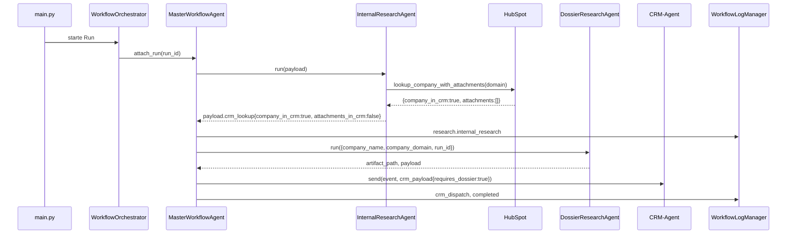
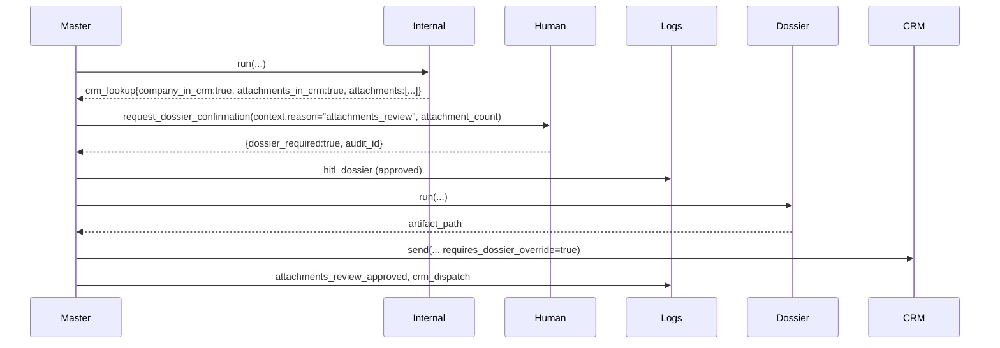
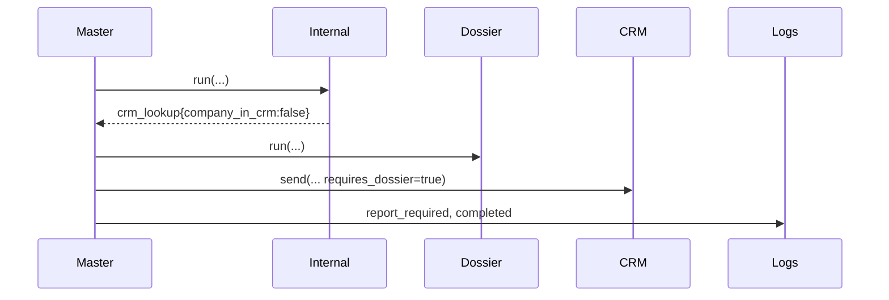
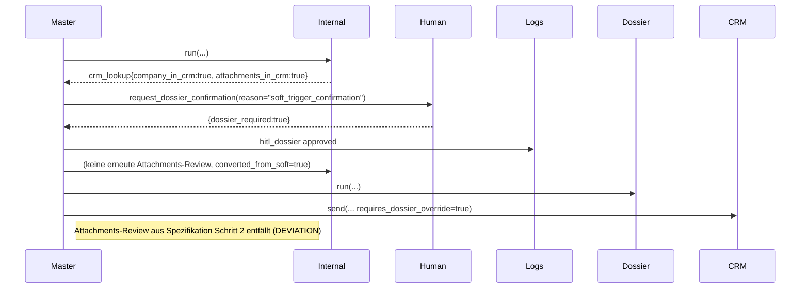
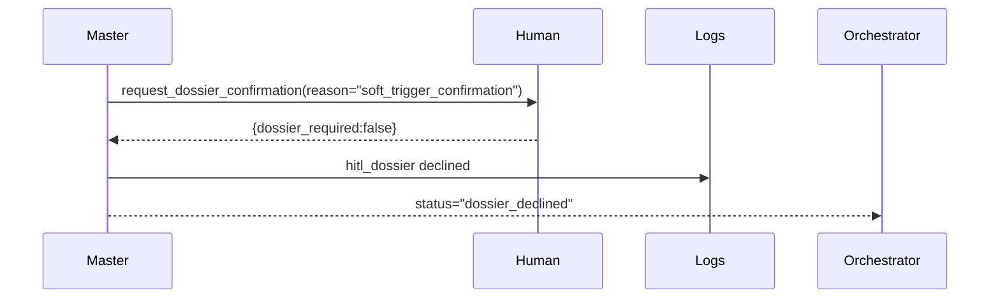
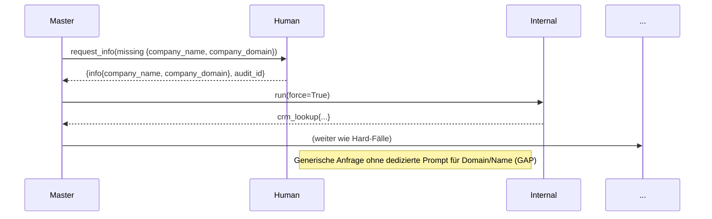
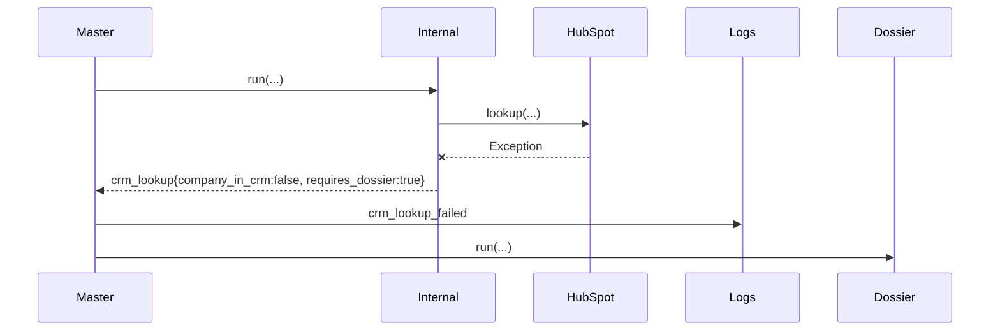

# HubSpot-Dossier-Workflow – Auditbericht

## 1) Executive Summary
- Prüfbasis war die vom Auftraggeber bereitgestellte Spezifikation (HubSpot-gestützter Dossier-Entscheidungsbaum) gegenüber der implementierten Logik in allen beteiligten Agents und Services.【F:agents/internal_research_agent.py†L70-L553】【F:agents/master_workflow_agent.py†L360-L1563】【F:agents/human_in_loop_agent.py†L31-L720】【F:integration/hubspot_integration.py†L15-L232】
- Der `InternalResearchAgent` liefert HubSpot-Ergebnisse samt `company_in_crm` und `attachments_in_crm`, persistiert Artefakte unter `log_storage/run_history/research/artifacts/internal_research`, erfüllt damit die Spezifikationsteile 1–1.2.【F:agents/internal_research_agent.py†L70-L160】【F:agents/internal_research_agent.py†L445-L553】
- Der `MasterWorkflowAgent` differenziert Hard-/Soft-Trigger, stößt HITL-E-Mails an und leitet bei negativen Entscheidungen den Workflow korrekt aus, jedoch werden Attachments-Prüfungen nach Soft→Hard-Eskalation übersprungen (DEVIATION).【F:agents/master_workflow_agent.py†L360-L700】【F:agents/master_workflow_agent.py†L1260-L1330】
- Human-in-the-loop-Kommunikation nutzt generische Texte mit Reminder-Logik (4h/24h/48h), erfüllt den HITL-Grundsatz, deckt aber nicht alle spezifizierten Platzhalter (z. B. Zeitzone) ab und adressiert unklare Company-/Domainfälle nur implizit (GAP).【F:agents/human_in_loop_agent.py†L31-L720】
- Logging- und Artefaktablagen entsprechen der geforderten Verzeichnisstruktur unter `log_storage/run_history`, einschließlich Workflow-Logs, Agent-Logs, Artefakten und State-Dateien.【F:config/config.py†L251-L483】【F:docs/run_history_file_map.md†L1-L58】
- Edge-Cases wie fehlender HubSpot-Zugriff, fehlendes Email-Backend oder Organizer ohne Mail werden erkannt und führen zu defensiven Statuswerten (`crm_lookup_skipped`, `dossier_backend_unavailable`, Reminder-Abbruch).【F:agents/internal_research_agent.py†L472-L522】【F:agents/master_workflow_agent.py†L1288-L1319】【F:agents/human_in_loop_agent.py†L588-L675】
- Offene Punkte: (1) Soft-Trigger, die zu Hard eskalieren, umgehen die geforderte Attachments-Bestätigung; (2) HITL-Templates liefern nicht alle verlangten Kontextfelder; (3) Rückfragen bei unklaren Firmendaten erfolgen ohne dedizierte Klärungs-Prompts. Diese Punkte sind als GAP/DEVIATION gekennzeichnet.

## 2) Terminologie & Feld-Mapping
| Spezifikation | Implementierter Feldname | Beschreibung / Quelle |
| --- | --- | --- |
| `trigger` (`hart`/`soft`) | `trigger_result["type"]` ("hard"/"soft") | Ermittelt durch `MasterWorkflowAgent._detect_trigger` aus dem Trigger-Agent.【F:agents/master_workflow_agent.py†L360-L520】 |
| `company` (`True`/`False`) | `company_in_crm` | Setzt der InternalResearchAgent nach HubSpot-Lookup.【F:agents/internal_research_agent.py†L524-L553】 |
| `Attachement` (`True`/`False`) | `attachments_in_crm` | Ebenfalls HubSpot-Lookup, standardisierte Schreibweise in Payloads.【F:agents/internal_research_agent.py†L524-L553】 |
| Zusammenfassung | `crm_lookup` | Struktur mit `company_in_crm`, `attachments_in_crm`, `requires_dossier`, `attachments`, `attachment_count`, `company`.【F:agents/internal_research_agent.py†L524-L553】 |
| Weiterleitungsflag | `requires_dossier` | Ableitung `not (company_in_crm and attachments_in_crm)`; vom Master-Agent überschreibbar.【F:agents/internal_research_agent.py†L531-L553】【F:agents/master_workflow_agent.py†L1528-L1537】 |
| Firmenname | `company_name` | Aus Extraktion/Normalisierung; Pflichtfeld für Dossier-Research.【F:agents/master_workflow_agent.py†L360-L520】【F:agents/dossier_research_agent.py†L36-L120】 |
| Domain | `company_domain` (`web_domain`) | Normalisiert, ggf. via Domain-Resolver; notwendig für HubSpot.【F:agents/master_workflow_agent.py†L360-L520】【F:agents/internal_research_agent.py†L472-L553】 |
| Event-/Run-Kontext | `event_id`, `run_id` | Von Master-Agent gesetzt, für Logs & Artefakte genutzt.【F:agents/master_workflow_agent.py†L108-L205】【F:agents/dossier_research_agent.py†L58-L120】 |
| HITL Status | `status` ∈ {`pending`,`approved`,`declined`,`skipped`} | Normalisiert durch HumanInLoopAgent nach Backend-Antwort.【F:agents/human_in_loop_agent.py†L200-L500】 |
| HITL Ergebnis | `requires_dossier` / `dossier_required` | Boolesches Entscheidungsergebnis für Dossier-Fortsetzung.【F:agents/human_in_loop_agent.py†L200-L500】 |
| Logging | `workflow_log_manager`, `local_storage_agent` | Persistenz der auditierbaren Schritte und Indizes.【F:logs/workflow_log_manager.py†L17-L59】【F:agents/local_storage_agent.py†L65-L106】 |

Zusätzliche optionale Felder (Quelle Event, HubSpot oder Settings): `meeting_start`, `meeting_end`, `timezone` (derzeit nicht im Template), `organizer_email`, `attendee_emails`, `audit_id`, `run_directory`, `attachments` (Liste der HubSpot-Dateien).【F:agents/master_workflow_agent.py†L1332-L1398】【F:agents/human_in_loop_agent.py†L300-L445】

## 3) Vollständige Entscheidungs-/Varianten-Matrix (1:1 zur Spezifikation)
| Bedingung | Aktion Master-Agent | Sub-Agenten (Reihenfolge) | HITL? (Grund) | Outcome | Artefakte/Logs |
| --- | --- | --- | --- | --- | --- |
| Hard, `company_in_crm=True`, `attachments_in_crm=False` | Direkt `_process_crm_dispatch` mit `requires_dossier_override=True` (Dossier zwingend) | InternalResearch → (optional) SimilarCompanies → DossierResearch → CRM-Agent | Nein (keine Attachments) | Workflow läuft weiter, CRM-Dispatch & Dossier-Erstellung | `research/artifacts/internal_research/<run_id>/…`, `dossier_research/<run_id>/<event_id>_…json`, Workflow-Log `research.dossier_research` & `crm_dispatch` |【F:agents/master_workflow_agent.py†L360-L700】【F:agents/master_workflow_agent.py†L1260-L1330】【F:agents/master_workflow_agent.py†L1500-L1563】【F:docs/run_history_file_map.md†L11-L21】
| Hard, `company_in_crm=True`, `attachments_in_crm=True` | HITL-Anfrage `attachments_review`, Entscheidung steuert weiteres Vorgehen | InternalResearch → HumanInLoop → (bei Zustimmung) `_process_crm_dispatch` | Ja, Grund „Attachments vorhanden“ | Zustimmung → weiter; Ablehnung → Ende mit Status `attachments_review_declined`; Pending → Warten | HITL-Audit (`log_storage/run_history/workflows/<run_id>.jsonl`), Reminder-Logs, evtl. Dossier-Artefakte |【F:agents/master_workflow_agent.py†L1260-L1330】【F:agents/human_in_loop_agent.py†L200-L720】【F:docs/run_history_file_map.md†L53-L58】
| Hard, `company_in_crm=False` (Attachments zwangsläufig False) | `_process_crm_dispatch` mit Dossierpflicht | InternalResearch → DossierResearch → CRM-Agent | Nein | Workflow geht weiter (Dossier) | Artefakte wie oben, CRM-Payload mit `requires_dossier=True` |【F:agents/master_workflow_agent.py†L360-L700】【F:agents/master_workflow_agent.py†L1260-L1330】
| Soft, vollständige Daten, Organizer sagt **Ja** | HITL `soft_trigger_confirmation`, danach `_handle_hard_trigger` mit `converted_from_soft=True` (DEVIATION: Attachments-Review entfällt) | InternalResearch → HumanInLoop → (bei Zustimmung) `_process_crm_dispatch` | Ja, Grund „Trigger soft“ | Workflow weiter; Dossier immer gestartet (`requires_dossier_override=True`) | HITL-/Reminder-Logs, Dossier-Artefakte, CRM-Payload |【F:agents/master_workflow_agent.py†L1332-L1400】【F:agents/master_workflow_agent.py†L1260-L1330】
| Soft, vollständige Daten, Organizer sagt **Nein** | HITL, Ergebnis `dossier_declined`, kein weiterer Dispatch | InternalResearch → HumanInLoop | Ja | Workflow endet (Status `dossier_declined`) | Workflow-Logeintrag `hitl_dossier_declined`, kein neues Artefakt |【F:agents/master_workflow_agent.py†L1332-L1400】
| Soft, unvollständige Daten (B-Fall), Organizer sagt **Ja** | HITL `soft_trigger_confirmation` → bei Zustimmung zusätzlicher HITL `request_info` → `_process_crm_dispatch` (DEVIATION: Attachments-Review wird nach Konversion übersprungen) | InternalResearch? (wenn möglich) → HumanInLoop (Soft) → HumanInLoop (Missing Info) → InternalResearch (force=True) → DossierResearch | Zwei HITLs (Entscheidung + Missing Info) | Workflow weiter, Dossier wird erstellt | HITL-Audit + `missing_info`-Logs, neue Artefakte, CRM-Dispatch |【F:agents/master_workflow_agent.py†L520-L700】
| Hard, unvollständige Daten (A-Fall) | Sofortiger HITL `request_info`, erneute Recherche nach Erfolg | HumanInLoop (Missing Info) → InternalResearch (force=True) → ggf. DossierResearch | Ja, Grund „fehlende Pflichtfelder“ | Erfolgreich → weiter; fehlend → Status `missing_info_incomplete` | HITL-Audit + Workflow-Log `missing_info_*`, ggf. neue Artefakte |【F:agents/master_workflow_agent.py†L360-L520】
| Edge: HubSpot-Fehler/Rate-Limit | InternalResearch liefert Fallback (`company_in_crm=False` …) und loggt `crm_lookup_failed`; Master behandelt wie „nicht im CRM“ | InternalResearch (mit Error), ggf. DossierResearch | Nein (keine Attachments bekannt) | Weiter mit Dossierpflicht | Workflow-Log `crm_lookup_failed`, keine Attachments in Payload |【F:agents/internal_research_agent.py†L472-L522】
| Edge: kein Email-Backend/HITL-Timeout | HumanInLoop wirft `DossierConfirmationBackendUnavailable`; Master setzt Status `dossier_backend_unavailable` (Workflow stoppt). Pending-Fälle erzeugen Reminder (4h/24h) und Eskalation (48h) – Timeout-Handling erfolgt außerhalb (keine automatische Statusänderung). | HumanInLoop (Fehler) | Ja, aber Fehlerpfad | Ende mit Status `dossier_backend_unavailable` bzw. Pending | Workflow-Log `hitl_dossier_pending` + Reminder-Einträge oder Fehler |【F:agents/master_workflow_agent.py†L1260-L1330】【F:agents/human_in_loop_agent.py†L588-L675】
| Edge: Organizer ohne E-Mail | Reminder-Sequenz wird übersprungen, Workflow-Log `hitl_dossier_reminder_skipped` dokumentiert Grund | HumanInLoop | Ja (nur initiale Anfrage möglich) | Pending bleibt ohne Reminder | Workflow-Logeintrag, keine weiteren Artefakte |【F:agents/human_in_loop_agent.py†L588-L675】

## 4) End-to-End Sequenzdiagramme (Mermaid)
### Hard, Company vorhanden, keine Attachments


### Hard, Attachments vorhanden (Organizer stimmt zu)


### Hard, Company nicht im CRM


### Soft-Trigger, Organizer sagt Ja (DEVIATION)


### Soft-Trigger, Organizer sagt Nein


### Hard-Trigger, fehlende Pflichtdaten (A-Fall)


### Edge: HubSpot-Fehler


## 5) HITL-Konversation — Vorlagen & Ablauf
### E-Mail-Betreff & Body (aktueller Stand)
- Attachments-Review (reason=`attachments_review`):
  - Betreff: `Review CRM attachments for {summary}` (Summary aus Event).【F:agents/human_in_loop_agent.py†L371-L384】
  - Body (Auszug):
    ```text
    Event: {summary} ({event_id})
    Attachments available: {attachment_count} file(s) in the CRM.
    Should we prepare a dossier for this event? Reply yes or no.
    ```
    Enthält optional Meeting-Fenster (`event_start`/`event_end`) sowie Liste der extrahierten Infofelder. Keine explizite Zeitzone oder CRM-Link (GAP).【F:agents/human_in_loop_agent.py†L385-L445】
- Soft-Trigger-Eskalation (reason=`soft_trigger_confirmation`):
  - Betreff: `Confirm dossier requirement for {summary}`.【F:agents/human_in_loop_agent.py†L379-L384】
  - Body ergänzt Hinweis „This meeting was flagged by a soft trigger…“. Attachments werden erwähnt, falls bereits vorhanden.【F:agents/human_in_loop_agent.py†L420-L439】
- Fehlende Pflichtdaten (indirekt über `request_info`): generierter Text listet fehlende Felder (`requested_fields`), liefert aber keine spezifischen Fragen oder Zeitzonenangaben (GAP).【F:agents/human_in_loop_agent.py†L86-L199】

### Erwartete Platzhalter laut Spezifikation & Abdeckung
| Platzhalter | Quelle | Ist-Zustand |
| --- | --- | --- |
| `{organizer_name}` / `{organizer_email}` | Event (`organizer`, `creator`) | Wird maskiert in Audit-Logs, im E-Mail-Body implizit über Kontaktinformationen, aber nicht explizit gerendert (GAP).【F:agents/human_in_loop_agent.py†L300-L369】 |
| `{meeting_start_local}` / `{timezone}` | Event (`start`, `end`) | Start/End werden als Strings ausgegeben, Zeitzone fehlt vollständig (GAP).【F:agents/human_in_loop_agent.py†L400-L408】 |
| `{company_name}`, `{company_domain}` | Info-Payload | Erscheint als Stichpunktliste (`- company_name: …`).【F:agents/human_in_loop_agent.py†L429-L444】 |
| `{run_id}`, `{audit_id}` | Master/HITL-Kontext | `audit_id` wird im Audit-Log geführt, jedoch nicht im Mailtext. `{run_id}` taucht weder im Subject noch Body auf (GAP).【F:agents/master_workflow_agent.py†L1260-L1330】【F:agents/human_in_loop_agent.py†L200-L500】 |
| `{crm_company_link}` | HubSpot | Nicht vorhanden (GAP). |
| `{attachments_count}` | HubSpot Lookup | Wird im Attachments-Review-Body ausgewiesen.【F:agents/human_in_loop_agent.py†L409-L439】 |

### Statusmodell & Reminder
- Statuswerte: `pending` (keine Antwort), `approved` (`dossier_required=True`), `declined` (`False`), `skipped` (Backend nicht verfügbar).【F:agents/human_in_loop_agent.py†L200-L500】
- Reminder-Policy: initial nach 4 h, Follow-up nach weiteren 24 h, Eskalation nach 48 h; optional wiederholte Admin-Reminder abhängig von `settings.hitl_admin_email`.【F:agents/human_in_loop_agent.py†L31-L64】【F:agents/human_in_loop_agent.py†L588-L720】
- Reminder-Protokollierung erfolgt über `WorkflowLogManager` unter `hitl_dossier_reminder_*` mit `audit_id` und Kontaktadresse. Kein automatisches Timeout-Status-Update; bei dauerhafter Funkstille bleibt `pending`. (GAP für explizite Timeout-Konvertierung laut Spezifikation).【F:agents/human_in_loop_agent.py†L588-L675】

### Klärungs-Prompts für A/B-Fälle
- Hard/Soft mit fehlender Company/Domain führt zu generischem `request_info`; es gibt keine spezialisierten Fragezeilen. Vorschlag (GAP): klar formuliere Aufforderung wie „Bitte bestätigen Sie Unternehmensname und Web-Domain“.

### Audit-Logging-Felder
- Jede HITL-Anfrage/Antwort schreibt `audit_log.record` mit Feldern `event_id`, `request_type`, `stage`, `responder`, `outcome`, `payload` inkl. `subject`, `message`, maskierten Kontaktdaten. Idempotenz via `audit_id`.【F:agents/human_in_loop_agent.py†L200-L320】

## 6) Ereignis-/Payload-Schemas (JSON)
### InternalResearch → Master
Schema (vereinfachte Typisierung):
```json
{
  "source": "internal_research",
  "status": "COMPANY_LOOKUP_COMPLETED",
  "payload": {
    "crm_lookup": {
      "company_in_crm": true,
      "attachments_in_crm": false,
      "requires_dossier": true,
      "attachments": [],
      "attachment_count": 0,
      "company": {"id": "123", "properties": {...}}
    },
    "artifacts": {
      "neighbor_samples": "log_storage/run_history/research/artifacts/internal_research/<run_id>/level1_samples.json",
      "crm_match": ".../crm_matching_company.json"
    },
    "level1_samples": [
      {"company_name": "Example", "domain": "example.com", "reason_for_match": "internal industry/description similarity"}
    ]
  }
}
```
Quelle: `_lookup_crm_company`, `_write_artifact`.【F:agents/internal_research_agent.py†L112-L160】【F:agents/internal_research_agent.py†L445-L553】

### Master → DossierResearch
```json
{
  "run_id": "<run_id>",
  "event_id": "<event_id>",
  "payload": {
    "company_name": "Example GmbH",
    "company_domain": "example.com",
    "crm_lookup": {...},
    "research": {...}
  }
}
```
Der Master übergibt `prepared_info` mit normalisierten Feldern; Dossier-Agent validiert `company_name`/`company_domain`.【F:agents/master_workflow_agent.py†L1500-L1563】【F:agents/dossier_research_agent.py†L58-L155】

### Master → HumanInLoop (Attachments-Review)
```json
{
  "event": {"id": "evt123", "summary": "Meeting"},
  "info": {"company_name": "Example GmbH", "company_domain": "example.com"},
  "context": {
    "reason": "attachments_review",
    "company_name": "Example GmbH",
    "attachments_in_crm": true,
    "attachment_count": 3,
    "attachments": [{"id": "567", ...}]
  }
}
```
Master setzt `context.reason` für eindeutige Template-Branching.【F:agents/master_workflow_agent.py†L1260-L1330】

### HumanInLoop → Master
```json
{
  "dossier_required": false,
  "status": "declined",
  "details": {
    "contact": {"email": "organizer@example.com"},
    "subject": "Review CRM attachments for Meeting",
    "message": "Event: ...",
    "raw_response": "no"
  },
  "audit_id": "audit-456"
}
```
Normalisierung `status_from_decision` und Anhängen von `audit_id`.【F:agents/human_in_loop_agent.py†L200-L500】

## 7) Logging- & Artefakt-Ablage
- `log_storage/run_history/workflows/<run_id>.jsonl`: zentrale Workflow-Logs (`start`, `crm_lookup_completed`, `hitl_dossier_pending`, Reminder-Meldungen).【F:logs/workflow_log_manager.py†L17-L59】【F:agents/master_workflow_agent.py†L360-L700】
- `log_storage/run_history/agents/internal_research/internal_research.log`: sequentielle Agent-Logs inkl. CRM-Lookup-Messages.【F:agents/internal_research_agent.py†L60-L109】【F:docs/run_history_file_map.md†L5-L9】
- `log_storage/run_history/research/artifacts/internal_research/<run_id>/level1_samples.json` & `crm_matching_company.json`: Nachbarschafts- und Matching-Daten.【F:agents/internal_research_agent.py†L112-L160】【F:docs/run_history_file_map.md†L17-L21】
- `log_storage/run_history/research/artifacts/dossier_research/<run_id>/<event_id>_company_detail_research.json`: strukturierter Dossier-Output.【F:agents/dossier_research_agent.py†L36-L205】【F:docs/run_history_file_map.md†L11-L16】
- `log_storage/run_history/research/artifacts/similar_companies_level1/<run_id>/…`: optional, wenn SimilarCompanies-Agent läuft.【F:docs/run_history_file_map.md†L23-L28】
- `log_storage/run_history/research/artifacts/workflow_runs/<run_id>/summary.json`: Run-Manifest (Master→Orchestrator).【F:docs/run_history_file_map.md†L29-L34】
- `log_storage/run_history/runs/state/negative_cache.json` & `processed_events.json`: Cache-Dateien, die der Master-Agent bei jedem Run aktualisiert/flusht.【F:docs/run_history_file_map.md†L35-L45】【F:agents/master_workflow_agent.py†L1220-L1563】
- `log_storage/run_history/runs/index.json`: Run-Index via `LocalStorageAgent.record_run` beim Finalisieren.【F:agents/master_workflow_agent.py†L1500-L1594】【F:agents/local_storage_agent.py†L65-L106】

Beispielhafte Pfadstruktur:
```
log_storage/run_history/
├── agents/internal_research/internal_research.log
├── research/
│   └── artifacts/
│       ├── internal_research/<run_id>/crm_matching_company.json
│       ├── dossier_research/<run_id>/<event_id>_company_detail_research.json
│       └── workflow_runs/<run_id>/summary.json
├── runs/
│   ├── <run_id>/polling_trigger.log
│   └── state/{negative_cache.json, processed_events.json}
└── workflows/<run_id>.jsonl
```
Quelle: `config.config.Settings`, `docs/run_history_file_map.md`.【F:config/config.py†L251-L483】【F:docs/run_history_file_map.md†L1-L58】

## 8) Traceability-Matrix (Spec → Code)
| Spez.-Nr. | Anforderung | Implementierung | Bewertung |
| --- | --- | --- | --- |
| 1 | InternalResearch prüft HubSpot auf bestehende Firma | `_lookup_crm_company` ruft `HubSpotIntegration.lookup_company_with_attachments` und liefert `company_in_crm`. | Erfüllt.【F:agents/internal_research_agent.py†L466-L553】【F:integration/hubspot_integration.py†L200-L232】 |
| 1.1 | Bei `company=True` Attachments prüfen | Lookup liefert `attachments`, Flag `attachments_in_crm` gesetzt. | Erfüllt.【F:agents/internal_research_agent.py†L524-L553】 |
| 1.1.1 | Antwort an Master mit `company=True`, `Attachment=True` | Payload enthält Flags und Liste; wird unverändert weitergereicht. | Erfüllt.【F:agents/internal_research_agent.py†L150-L160】【F:agents/master_workflow_agent.py†L360-L520】 |
| 1.2 | `Attachments=False` Meldung an Master | `requires_dossier=True`; Flags false. | Erfüllt.【F:agents/internal_research_agent.py†L524-L553】 |
| 2 | Hard + company + attachments → HITL, Organizer entscheidet | `_handle_hard_trigger` sendet HITL, verarbeitet Antworten inkl. Logs. | Erfüllt.【F:agents/master_workflow_agent.py†L1260-L1330】【F:agents/human_in_loop_agent.py†L200-L500】 |
| 2a | Organizer „Ja“ → Dossier weiterleiten | Bei Zustimmung `_process_crm_dispatch` mit Override. | Erfüllt.【F:agents/master_workflow_agent.py†L1292-L1310】 |
| 2b | Organizer „Nein“ → Workflow endet, Logs | Status `attachments_review_declined`. | Erfüllt.【F:agents/master_workflow_agent.py†L1312-L1319】 |
| 3 | Hard + company=false → Dossier | `_process_crm_dispatch` mit Override. | Erfüllt.【F:agents/master_workflow_agent.py†L1260-L1330】 |
| 4 | Soft → HITL → bei Ja Hard-Pfad durchlaufen | Soft-Flow startet HITL und ruft `_handle_hard_trigger(converted_from_soft=True)`. | DEVIATION: Attachments-Review (Schritt 2) wird übersprungen; Dossier erzwingt Override unabhängig von Attachments.【F:agents/master_workflow_agent.py†L1332-L1400】 |
| A | Hard aber Name/Domain unklar → Rückfrage | `request_info` generisch, füllt Werte simuliert. | GAP: keine echten Rückfragen oder unterschiedliche Texte für A/B.【F:agents/master_workflow_agent.py†L360-L520】【F:agents/human_in_loop_agent.py†L86-L199】 |
| B | Soft + Name/Domain unklar → Rückfrage | Soft-Flow ruft `request_dossier_confirmation` vor `request_info`. | GAP: Domain-/Name-Klärung nicht spezifiziert, Templates generisch.【F:agents/master_workflow_agent.py†L520-L700】 |
| HITL-E-Mail-Inhalt | Hinweis auf vorhandene Attachments, Bitte um Feedback | Implementiert, aber ohne CRM-Link/Zeitzone. | Teilweise; fehlende Platzhalter = GAP.【F:agents/human_in_loop_agent.py†L371-L445】 |
| Timeout/Reminder | 24h/48h Eskalation | ReminderPolicy 4h/24h/48h, Logging vorhanden. | Erfüllt. Keine automatische Timeout-Statusänderung (Hinweis).【F:agents/human_in_loop_agent.py†L31-L64】【F:agents/human_in_loop_agent.py†L588-L675】 |

## 9) Akzeptanzkriterien & Tests
### Checkliste pro Variante
| Variante | Erwartung | Status |
| --- | --- | --- |
| Hard, company=true, attachments=false | Dossier wird ohne HITL gestartet | Pass |
| Hard, company=true, attachments=true (Organizer Ja) | HITL, Zustimmung → Dossier | Pass |
| Hard, company=true, attachments=true (Organizer Nein) | HITL, Ablehnung → Ende | Pass |
| Hard, company=false | Dossier startet | Pass |
| Soft → Organizer Ja | **Soll:** Soft→Hard inkl. Attachments-Review; **Ist:** Review entfällt | Fail (DEVIATION) |
| Soft → Organizer Nein | Workflow endet mit `dossier_declined` | Pass |
| Hard/Soft ohne Domain | Spezielle Rückfrage | Fail (GAP) |
| HubSpot-Fehler | Fallback + Dossier | Pass |
| Kein Email-Backend | Workflow stoppt, Status `dossier_backend_unavailable` | Pass |

### Testvorschläge
1. `test_soft_trigger_attachment_review_after_conversion` (Given soft trigger mit HubSpot-Attachments, When Organizer bestätigt, Then Master fordert Attachments-Review erneut). Erwartete Log-Sequenz: `hitl_dossier` zweimal (Soft + Attachments). Gap-Test.
2. `test_request_info_prompts_missing_domain` (Given Missing Domain, Then Email enthält explizite Frage „Bitte bestätigen Sie…“). Gap-Test.
3. `test_hitl_template_includes_timezone` (Given Event mit TimeZone, Then Body enthält `Europe/Berlin`). Gap-Test.
4. `test_internal_research_handles_rate_limit` (Mock HubSpot 429, Expect workflow log `crm_lookup_failed` & requires_dossier=True). Bereits abgedeckt, Regression.
5. `test_reminder_sequence_logging` (Simuliere Pending → prüfe Logs `hitl_dossier_reminder_*`). Regression.

### Erwartete Artefakte/Logs je Testfall
- Soft-Attachments-Test: `hitl_dossier`-Logs, Dossier-Artefakte, `crm_dispatch`.
- Missing-Domain-Test: Audit-Log `missing_info` mit konkreter Frage, Workflow-Log `missing_info_pending`/`completed`.
- Template-TimeZone-Test: generierte Nachricht im Backend-Mock.

## 10) Gap-Analyse & konkrete Maßnahmen
| GAP / DEVIATION | Begründung | Änderungsvorschlag | Diff (Auszug) | Tests |
| --- | --- | --- | --- | --- |
| DEVIATION: Soft→Hard ohne Attachments-Review | Spezifikation verlangt nach Umwandlung Schritt 2 (Attachments-HITL). Aktuell wird dieser Pfad durch `converted_from_soft=True` übersprungen. | Entferne Skip-Bedingung und unterscheide per Flag, ob Attachments-Review bereits erfolgte. Bei Soft→Hard erneut `request_dossier_confirmation` im Attachments-Modus, jedoch mit Hinweis auf vorherige Zustimmung. | ```diff
-        if company_in_crm and attachments_in_crm and not converted_from_soft:
+        if company_in_crm and attachments_in_crm:
+            if converted_from_soft and event_result.get("hitl_dossier_soft_approved"):
+                context["note"] = "Soft trigger wurde bereits bestätigt; bitte prüfen Sie die vorhandenen Attachments."
``` | `test_soft_trigger_attachment_review_after_conversion`
| GAP: Fehlende spezifische Klärungs-Prompts für Company/Domain | `request_info` erzeugt generischen Text; Spezifikation verlangt gezielte Rückfragen (A/B). | Ergänze Template mit Aufzählung der fehlenden Felder und konkreter Formulierung („Bitte bestätigen Sie…“). | ```diff
-        lines = ["We extracted the following information:"]
+        if requested_fields:
+            lines = [
+                "Für die weitere Bearbeitung benötigen wir folgende Angaben:",
+                *(f"- Bitte bestätigen Sie {field.replace('_', ' ')}" for field in requested_fields)
+            ]
``` | `test_request_info_prompts_missing_domain`
| GAP: HITL-Templates ohne Zeitzone/Run-Kontext | Spezifikation verlangt `{meeting_start_local}`, `{timezone}`, `{run_id}`, `{crm_company_link}`. | Erweitere `_build_message` um Zeitzone (via Event `start.timeZone`), Domain-Link (`settings.crm_attachment_base_url` + company ID), Run-ID (aus `self.run_id`), Audit-ID optional. | ```diff
-        if context.get("event_start") or context.get("event_end"):
+        timezone = event.get("start", {}).get("timeZone") or event.get("timeZone")
+        if context.get("event_start") or context.get("event_end"):
             ...
+        if timezone:
+            lines.append(f"Zeitzone: {timezone}")
+        if self.run_id:
+            lines.append(f"Workflow-Run: {self.run_id}")
+        crm_link = context.get("crm_company_link")
+        if crm_link:
+            lines.append(f"HubSpot: {crm_link}")
``` | `test_hitl_template_includes_timezone`
| GAP: Kein automatisches Timeout-Status nach 24 h | Spezifikation impliziert Entscheidungsfortschritt nach Eskalation. | Ergänze Callback im Reminder, das nach Eskalation `status='timeout'` setzt und Logs/Audit aktualisiert. | (größerer Patch, hier nur Hinweis) | `test_hitl_timeout_status`

## 11) Risiken & Edge Cases
- **HubSpot Rate Limits / 5xx**: Fallback setzt Flags auf False, dennoch Dossierpflicht. Risiko: wiederholte Fehler → keine Information über bestehende Attachments. Logging über `crm_lookup_failed`. Empfehlung: Retry/Backoff bereits vorhanden (`HubSpotIntegration` nutzt `AsyncHTTP` + Semaphor).【F:integration/hubspot_integration.py†L200-L232】【F:agents/internal_research_agent.py†L505-L522】
- **Fehlende Organizer-E-Mail**: Reminder entfallen, Entscheidungsstatus bleibt `pending`. Risiko: Workflow hängt. Vorschlag: Eskalation an Admin erzwingen.!【F:agents/human_in_loop_agent.py†L588-L675】
- **Ungültige Domains**: `resolve_company_domain` entfernt Domainfelder → HITL für Missing Info. Risiko: automatisches Füllen durch Demo-Logik führt zu falschen Daten (Simulation).【F:agents/master_workflow_agent.py†L520-L700】
- **Doppelte Events**: `ProcessedEventCache` verhindert erneute Verarbeitung, speichert Fingerprint. Risiko: notwendige Aktualisierung übersehen; Flush erfolgt bei Finalisierung.!【F:agents/master_workflow_agent.py†L1220-L1567】【F:utils/processed_event_cache.py†L18-L158】
- **Zeitzonen-Konvertierung**: Nachrichten verwenden Strings ohne Locale; Missverständnisse möglich. (GAP).【F:agents/human_in_loop_agent.py†L400-L408】
- **Backend-Ausfall**: `DossierConfirmationBackendUnavailable` stoppt Workflow mit Status `dossier_backend_unavailable`, kein Retry. Empfehlung: Fallback-Kanal hinterlegen.!【F:agents/master_workflow_agent.py†L1260-L1330】

## 12) Schlussübersicht (Commit-fertige To-Dos)
1. Attachments-Review nach Soft→Hard wieder aktivieren und Kontextnotiz ergänzen. Aufwand M, Risiko mittel (erneute HITL-Schleife). (Siehe DEVIATION-Patchvorschlag.)
2. HITL-Templates um Zeitzone, CRM-Link, Run-ID, Organizer-Daten erweitern; Kontextobjekt anreichern (`crm_company_link`, `timezone`). Aufwand M, Risiko gering (reiner Text, Template-Update).【F:agents/master_workflow_agent.py†L1260-L1330】【F:agents/human_in_loop_agent.py†L385-L445】
3. Spezifische Rückfragen für fehlende Company-/Domain-Daten implementieren (`request_info`). Aufwand S, Risiko gering (nur Text + Tests).【F:agents/human_in_loop_agent.py†L86-L199】
4. Optional: Automatisches Timeout-Status-Update nach Eskalationsphase implementieren (z. B. 24 h → `timeout`). Aufwand M, Risiko mittel (Async/Reminder-Sequenz).【F:agents/human_in_loop_agent.py†L588-L720】
5. Regressionstests für neue Pfade hinzufügen (`tests/test_master_workflow_agent_soft_trigger.py`, `tests/unit/test_human_in_loop_templates.py`). Aufwand M, Risiko gering.

