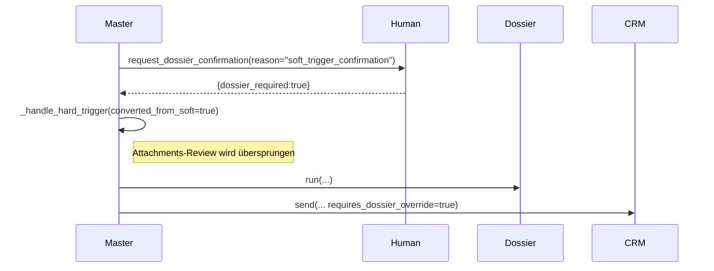

# HubSpot-Dossier-Workflow – Auditbericht

## 1) Executive Summary
- Grundlage der Prüfung war die bereitgestellte Spezifikation zu HubSpot-Dossier-Entscheidungen; analysiert wurden der InternalResearchAgent, MasterWorkflowAgent, HumanInLoopAgent sowie die Persistenzpfade inklusive HubSpot-Integration und Kommunikations-Backends.【F:agents/internal_research_agent.py†L70-L167】【F:agents/master_workflow_agent.py†L320-L510】【F:agents/human_in_loop_agent.py†L31-L733】【F:config/config.py†L250-L520】
- InternalResearchAgent ruft HubSpot anhand der Domain auf, kennzeichnet `company_in_crm`/`attachments_in_crm`, berechnet `requires_dossier` und legt Artefakte (Neighbor-Samples, CRM-Matching) samt Workflow-Logs im Run-Verzeichnis ab.【F:agents/internal_research_agent.py†L109-L167】【F:agents/internal_research_agent.py†L466-L553】
- MasterWorkflowAgent verzweigt Hard-/Soft-Trigger, orchestriert Missing-Info-HITL, Attachment-Reviews, Dossier- und Similar-Research und leitet bei Zustimmung an den CRM-Agenten weiter; Soft→Hard-Eskalationen überspringen allerdings die erneute Attachment-Prüfung (DEVIATION).【F:agents/master_workflow_agent.py†L393-L500】【F:agents/master_workflow_agent.py†L1236-L1564】【F:agents/master_workflow_agent.py†L1332-L1405】
- HumanInLoopAgent erstellt englische Betreff-/Body-Templates mit Reminder- und Eskalationslogik (4h, +24h, +48h) und protokolliert Audit-Einträge; spezifische deutschsprachige Rückfragen, Zeitzonen- bzw. CRM-Link-Platzhalter fehlen (GAP).【F:agents/human_in_loop_agent.py†L31-L199】【F:agents/human_in_loop_agent.py†L369-L445】【F:agents/human_in_loop_agent.py†L553-L695】
- Persistenz erfüllt die geforderten Verzeichnisse `log_storage/run_history/...` für Agent-Logs, Artefakte, Workflow-Logs, Negative-/Processed-Cache und Run-Index; der Workflow-Orchestrator schreibt zusätzliche Run-Summaries.【F:config/config.py†L250-L520】【F:agents/internal_research_agent.py†L112-L167】【F:agents/dossier_research_agent.py†L58-L205】【F:agents/workflow_orchestrator.py†L611-L637】【F:agents/local_storage_agent.py†L65-L106】
- Fehlerpfade (fehlende Domain, HubSpot-Timeout/429, unkonfiguriertes E-Mail-Backend, Organizer ohne Mail, Reminder-Eskalation) setzen defensiv `requires_dossier`, brechen mit `dossier_backend_unavailable` ab oder halten Status `pending` ohne automatischen Timeout (GAP).【F:agents/internal_research_agent.py†L472-L553】【F:integration/hubspot_integration.py†L171-L257】【F:agents/master_workflow_agent.py†L1269-L1319】【F:agents/human_in_loop_agent.py†L599-L695】
- Vorarbeiten des ExtractionAgent markieren unvollständige Company-Daten; Missing-Info-Pfade liefern jedoch nur generische Simulationen und keine gezielten Prompts, weshalb Spezifikationspunkte A/B als GAP gelten.【F:agents/master_workflow_agent.py†L355-L500】【F:agents/human_in_loop_agent.py†L86-L167】

## 2) Terminologie & Feld-Mapping
| Spezifikation | Implementierte Felder | Beschreibung & Quelle |
| --- | --- | --- |
| `trigger` ∈ {`hard`,`soft`} | `trigger_result["type"]` | Trigger-Erkennung speichert den Typ, der in `_handle_hard_trigger` bzw. `_handle_soft_trigger` weiterverarbeitet wird.【F:agents/master_workflow_agent.py†L322-L510】 |
| `company` (`True`/`False`) | `crm_lookup["company_in_crm"]` | InternalResearchAgent setzt Flag nach HubSpot-Lookup und meldet es im Payload an den Master-Agenten.【F:agents/internal_research_agent.py†L136-L167】【F:agents/internal_research_agent.py†L466-L553】 |
| `Attachement` | `crm_lookup["attachments_in_crm"]` | Gleiches Lookup liefert Liste & Zähler der Attachments, daraus resultiert das Flag.【F:agents/internal_research_agent.py†L524-L553】 |
| Antwort an Master | `payload.crm_lookup` | Enthält Flags, Attachments, `requires_dossier`, Artefaktpfade (`neighbor_samples`, `crm_match`).【F:agents/internal_research_agent.py†L150-L167】 |
| Weiterleitungsentscheidung | `requires_dossier` | Wird von InternalResearchAgent gesetzt und vom Master-Agenten via `requires_dossier_override` überschrieben.【F:agents/internal_research_agent.py†L529-L553】【F:agents/master_workflow_agent.py†L1499-L1538】 |
| Pflichtfelder | `company_name`, `company_domain` | Extraktion normalisiert Name/Domain; fehlen Werte, triggert Missing-Info-HITL.【F:agents/master_workflow_agent.py†L355-L500】 |
| Kontextfelder | `event_id`, `run_id`, `attachments`, `attachment_count`, `event_start`, `event_end` | Master-Agent reichert HITL-Kontext mit Event-/Attachmentdaten an; DossierAgent persistiert `run_id`/`event_id`.【F:agents/master_workflow_agent.py†L1350-L1363】【F:agents/dossier_research_agent.py†L68-L176】 |
| HITL-Ergebnis | `dossier_required`, `status` (`approved`,`declined`,`pending`) | HumanInLoopAgent normalisiert Backend-Antworten und steuert Reminder bei Pending-Status.【F:agents/human_in_loop_agent.py†L169-L296】【F:agents/human_in_loop_agent.py†L572-L604】 |
| Optionale Felder laut Implementation | `{organizer_name}`, `{organizer_email}`, `{attachments_count}`, `{run_id}` etc. | Organizerdaten werden maskiert, Attachments gezählt; `run_id`/`audit_id` erscheinen nur in Logs, nicht im Mailtext (GAP).【F:agents/human_in_loop_agent.py†L205-L293】【F:agents/human_in_loop_agent.py†L399-L445】 |

## 3) Vollständige Entscheidungs-/Varianten-Matrix (1:1 zur Spezifikation)
| Bedingung | Aktion Master-Agent | Sub-Agenten (Reihenfolge) | HITL? / Grund | Outcome | Artefakte & Logs |
| --- | --- | --- | --- | --- | --- |
| Hard, `company_in_crm=true`, `attachments_in_crm=false` | `_process_crm_dispatch` erzwingt Dossier, CRM-Dispatch nach Research | InternalResearch → DossierResearch → (optional) SimilarCompanies → CRM-Agent | Nein (keine Attachments) | Workflow läuft weiter, Status `dispatched_to_crm` | Workflow-Logs, interne Artefakte & Dossier-Datei im Run-Verzeichnis.【F:agents/master_workflow_agent.py†L1236-L1331】【F:agents/master_workflow_agent.py†L1499-L1564】【F:agents/dossier_research_agent.py†L58-L205】 |
| Hard, `company_in_crm=true`, `attachments_in_crm=true` | HITL `attachments_review`; Zustimmung startet Dossier, Ablehnung beendet Workflow | InternalResearch → HumanInLoop → (bei Zustimmung) DossierResearch → CRM-Agent | Ja (Bewertung vorhandener Dokumente) | Zustimmung → `dispatched_to_crm`; Ablehnung → `attachments_review_declined`; Pending → Reminder | HITL-/Audit-Logs, Workflow-Schritte `attachments_review_*`, Reminder-Schedule.【F:agents/master_workflow_agent.py†L1258-L1320】【F:agents/human_in_loop_agent.py†L169-L296】【F:agents/human_in_loop_agent.py†L553-L695】 |
| Hard, `company_in_crm=false` | Dossier wird erzwungen, CRM-Dispatch nach Research | InternalResearch → DossierResearch → CRM-Agent | Nein | Status `dispatched_to_crm` | Gleiche Artefakt- und Logpfade wie oben.【F:agents/master_workflow_agent.py†L1236-L1331】【F:agents/master_workflow_agent.py†L1499-L1564】 |
| Soft → Organizer „Ja“ | Soft-HITL bestätigt, Master ruft `_handle_hard_trigger(converted_from_soft=True)` auf (DEVIATION: Attachments-Review entfällt) | HumanInLoop → Master (Hard-Pfad) → DossierResearch/CRM | Ja, Soft-Eskalation | Workflow läuft weiter, Dossier immer erzeugt | HITL-Protokoll + Research/CRM-Artefakte; kein zweiter Review-Schritt.【F:agents/master_workflow_agent.py†L1332-L1405】 |
| Soft → Organizer „Nein“ | Workflow endet mit `dossier_declined` | HumanInLoop | Ja | Ende, keine weiteren Aktionen | Workflow-Log `dossier_declined`, Audit-Record.【F:agents/master_workflow_agent.py†L1332-L1415】 |
| Soft, unvollständige Daten (B-Fall) | Erst Soft-HITL, anschließend Missing-Info-Anfrage; nach erfolgreicher Ergänzung Hard-Pfad | HumanInLoop (Soft) → HumanInLoop (`request_info`) → InternalResearch (force) → Master Hard-Pfad | Ja (zweifach) | Erfolg → Standard-Hard; fehlende Daten → `missing_info_incomplete` | Workflow-Logs `hitl_dossier_pending`, `missing_info_*`, Audit-Einträge.【F:agents/master_workflow_agent.py†L502-L597】【F:agents/human_in_loop_agent.py†L86-L167】 |
| Hard, unvollständige Daten (A-Fall) | Sofortiges `request_info`; bei Erfolg erneuter Hard-Pfad | HumanInLoop (`request_info`) → InternalResearch (force) → Master Hard-Pfad | Ja (fehlende Pflichtfelder) | Erfolg → Standard-Hard; Scheitern → `missing_info_incomplete` | Workflow-Logs & Audit `missing_info`, erneute Research-Artefakte.【F:agents/master_workflow_agent.py†L429-L500】 |
| Edge: HubSpot-Fehler / Rate-Limit | InternalResearch fängt Exceptions, setzt Flags auf False und `requires_dossier=True` | InternalResearch → Master Hard-Pfad | Nein | Weiter mit Dossierpflicht | Workflow-Log `crm_lookup_failed`, keine Attachments im Payload.【F:agents/internal_research_agent.py†L488-L553】【F:integration/hubspot_integration.py†L171-L257】 |
| Edge: Kein Email-Backend | HumanInLoop wirft `DossierConfirmationBackendUnavailable`, Master beendet mit `dossier_backend_unavailable` | HumanInLoop | Ja (Fehlerpfad) | Workflow-Ende mit Fehlerstatus | Workflow-Log `dossier_backend_unavailable`, Audit-Eintrag `skipped`.【F:agents/master_workflow_agent.py†L1269-L1319】【F:agents/human_in_loop_agent.py†L220-L228】 |
| Edge: Organizer ohne Mail | Reminder werden übersprungen, Status bleibt Pending | HumanInLoop | Ja (initial) | Weiter `pending` (manuelle Nacharbeit) | Workflow-Log `hitl_dossier_reminder_skipped` mit Hinweis.【F:agents/human_in_loop_agent.py†L599-L607】 |
| Edge: Timeout ohne Antwort | Reminder/ Eskalation geplant, kein Auto-Timeout → manueller Eingriff nötig (GAP) | HumanInLoop | Ja (Reminder) | Status bleibt `pending` | Reminder-/Eskalations-Logs, Admin-Reminders möglich.【F:agents/human_in_loop_agent.py†L553-L695】 |

## 4) End-to-End Sequenzdiagramme (Mermaid)
Die Diagramme basieren auf den codierten Aufrufen in MasterWorkflowAgent (`_handle_hard_trigger`, `_handle_soft_trigger`), InternalResearchAgent (`run`/`_lookup_crm_company`) und HumanInLoopAgent (`request_dossier_confirmation`).【F:agents/master_workflow_agent.py†L1236-L1405】【F:agents/internal_research_agent.py†L70-L167】【F:agents/human_in_loop_agent.py†L169-L296】

### Hard, Firma im CRM ohne Attachments


### Hard, Attachments vorhanden (Organizer stimmt zu)


### Hard, Firma nicht im CRM


### Soft-Trigger, Organizer sagt „Ja“ (DEVIATION)


### Soft-Trigger, Organizer sagt „Nein“


### Hard-Trigger, fehlende Pflichtdaten (A-Fall)


### Soft-Trigger, fehlende Pflichtdaten (B-Fall)


### Edge: HubSpot-Fehler


## 5) HITL-Konversation — vollständige Vorlagen & Ablauf
### E-Mail-Betreff & Body laut Implementierung
- **Attachments-Review (`reason="attachments_review"`)**
  - Betreff: `Review CRM attachments for {summary}`.【F:agents/human_in_loop_agent.py†L371-L383】
  - Body (englisch):
    ```text
    Event: {summary} ({event_id})
    Scheduled: {event_start} - {event_end}
    We found an existing HubSpot company record with stored attachments.
    Attachments available: {attachment_count} file(s) in the CRM.
    - {info_key}: {info_value}

    Should we prepare a dossier for this event? Reply yes or no.
    ```
    `{attachment_count}` stammt aus dem HubSpot-Lookup; Zeitzone, CRM-Link oder Run-ID fehlen (GAP).【F:agents/human_in_loop_agent.py†L400-L445】

- **Soft-Trigger (`reason="soft_trigger_confirmation"`)**
  - Betreff: `Confirm dossier requirement for {summary}`.【F:agents/human_in_loop_agent.py†L371-L383】
  - Body ergänzt den Hinweis auf Soft-Trigger und listet extrahierte Infos sowie ggf. vorhandene Attachments.【F:agents/human_in_loop_agent.py†L419-L440】

- **Missing Info (`request_info`)**
  - Automatisierte Simulation füllt Name/Domain ohne gezielte Frageformulierung; reale Rückfrage müsste angepasste deutsche Prompts liefern (GAP).【F:agents/human_in_loop_agent.py†L86-L167】

### Platzhalter-Übersicht
| Platzhalter | Quelle | Status |
| --- | --- | --- |
| `{organizer_name}`, `{organizer_email}` | Event-Organizer/Creator | Wird maskiert im Audit, aber nicht explizit im Text verwendet (GAP).【F:agents/human_in_loop_agent.py†L205-L232】 |
| `{meeting_start_local}`, `{timezone}` | Event Start/`timeZone` | Zeiten erscheinen ohne Zeitzone; Lokalisierung fehlt (GAP).【F:agents/human_in_loop_agent.py†L400-L408】 |
| `{company_name}`, `{company_domain}` | `info`-Payload | Als Stichpunktliste enthalten.【F:agents/human_in_loop_agent.py†L429-L432】 |
| `{attachments_count}` | HubSpot-Lookup | Wird als Zahl ausgegeben.【F:agents/human_in_loop_agent.py†L410-L439】 |
| `{run_id}`, `{audit_id}` | Master-/Audit-Kontext | Nur im Audit-Log, nicht im Mailtext (GAP).【F:agents/master_workflow_agent.py†L168-L175】【F:agents/human_in_loop_agent.py†L270-L288】 |
| `{crm_company_link}` | Settings `crm_attachment_base_url` | Wird nicht befüllt (GAP).【F:config/config.py†L486-L487】 |

### Klärungsprompts für A/B-Fälle
Aktuell: generische Liste fehlender Felder, automatisches Ausfüllen. Spezifikation fordert explizite deutschsprachige Fragen („Bitte bestätigen Sie Unternehmensname/Web-Domain“).【F:agents/human_in_loop_agent.py†L110-L145】 **GAP**

### Statusmodell & Reminder
- Statuswerte: `approved`, `declined`, `pending`; es gibt kein automatisches `timeout` (GAP).【F:agents/human_in_loop_agent.py†L572-L587】
- Reminder-Policy: Initial nach 4 h, Folge nach weiteren 24 h, Eskalation nach 48 h inkl. optionaler Admin-Reminder; ohne Organizer-Mail werden Reminders übersprungen.【F:agents/human_in_loop_agent.py†L34-L38】【F:agents/human_in_loop_agent.py†L588-L695】
- Pending-Protokoll: Workflow-Log `hitl_dossier_pending`, Reminder-Schedule mit `metadata.audit_id` zur Nachverfolgung.【F:agents/human_in_loop_agent.py†L553-L675】

### Audit-Logging & Idempotenz
Jede Anfrage/Antwort erzeugt Audit-Einträge (`request_type`, `stage`, `responder`, `outcome`, Payload, `audit_id`), wodurch Antworten idempotent zugeordnet werden.【F:agents/human_in_loop_agent.py†L214-L288】【F:utils/audit_log.py†L13-L103】

## 6) Ereignis-/Payload-Schemas (JSON)
### InternalResearch → Master
```json
{
  "source": "internal_research",
  "status": "COMPANY_LOOKUP_COMPLETED",
  "payload": {
    "action": "COMPANY_LOOKUP_COMPLETED",
    "level1_samples": [ ... ],
    "crm_lookup": {
      "company_in_crm": true,
      "attachments_in_crm": false,
      "requires_dossier": true,
      "attachments": [],
      "attachment_count": 0,
      "company": { "id": "123", "properties": { ... } }
    },
    "artifacts": {
      "neighbor_samples": "log_storage/run_history/research/artifacts/internal_research/<run_id>/level1_samples.json",
      "crm_match": ".../crm_match_<event_id>.json"
    }
  }
}
```
Quelle: `run()` aggregiert Samples und CRM-Zusammenfassung.【F:agents/internal_research_agent.py†L109-L167】【F:agents/internal_research_agent.py†L466-L553】

### Master → DossierResearch (Startsignal)
```json
{
  "id": "<event_id>",
  "run_id": "<run_id>",
  "payload": {
    "company_name": "Example GmbH",
    "company_domain": "example.com",
    "research": { ... },
    "crm_lookup": { ... }
  }
}
```
Master übergibt normalisierte Infos an `_run_research_agent`; DossierAgent persistiert das Ergebnis als Artefakt.【F:agents/master_workflow_agent.py†L1499-L1564】【F:agents/dossier_research_agent.py†L58-L205】

### Master → HumanInLoop (Request)
```json
{
  "event": { "id": "evt123", "summary": "Meeting" },
  "info": { "company_name": "Example GmbH", "company_domain": "example.com" },
  "context": {
    "reason": "attachments_review",
    "company_name": "Example GmbH",
    "attachments_in_crm": true,
    "attachment_count": 3,
    "attachments": [{ "id": "567" }],
    "event_start": "2024-02-01T09:00:00Z",
    "event_end": "2024-02-01T09:30:00Z"
  }
}
```
Entsteht in `_handle_hard_trigger` bzw. `_handle_soft_trigger` vor dem HITL-Aufruf.【F:agents/master_workflow_agent.py†L1258-L1374】

### HumanInLoop → Master (Response)
```json
{
  "dossier_required": false,
  "status": "declined",
  "details": {
    "contact": { "email": "organizer@example.com" },
    "subject": "Review CRM attachments for Meeting",
    "message": "Event: ...",
    "context": { ... },
    "raw_response": "no"
  },
  "audit_id": "audit-456"
}
```
Normalisierung & Detail-Anreicherung erfolgen nach Backend-Response und Audit-Protokollierung.【F:agents/human_in_loop_agent.py†L240-L296】

## 7) Logging- & Artefakt-Ablage (mit Pfad-Referenzen)
- `log_storage/run_history/workflows/<run_id>.jsonl`: sequenzielle Workflow-Logs vom WorkflowLogManager.【F:logs/workflow_log_manager.py†L17-L59】【F:agents/master_workflow_agent.py†L360-L439】
- `log_storage/run_history/agents/internal_research/internal_research.log`: dedizierte Agent-Logs durch `_configure_file_logger`.【F:agents/internal_research_agent.py†L54-L109】
- `log_storage/run_history/research/artifacts/internal_research/<run_id>/level1_samples.json` & `crm_match_<event_id>.json`: Artefakte aus InternalResearch.【F:agents/internal_research_agent.py†L112-L167】
- `log_storage/run_history/research/artifacts/dossier_research/<run_id>/<event_id>_company_detail_research.json`: Persistiertes Dossier.【F:agents/dossier_research_agent.py†L58-L205】
- `log_storage/run_history/research/artifacts/similar_companies_level1/<run_id>/...`: Similar-Research, sofern aktiviert.【F:agents/int_lvl_1_agent.py†L98-L170】
- `log_storage/run_history/research/artifacts/workflow_runs/<run_id>/summary.json`: Run-Summary vom Workflow-Orchestrator.【F:agents/workflow_orchestrator.py†L611-L637】
- `log_storage/run_history/runs/<run_id>/polling_trigger.log`: Master-Agent-Logfile pro Run.【F:agents/master_workflow_agent.py†L129-L167】
- `log_storage/run_history/runs/state/negative_cache.json` & `processed_events.json`: Caches gegen Doppelverarbeitung.【F:agents/master_workflow_agent.py†L129-L138】【F:utils/negative_cache.py†L18-L152】【F:utils/processed_event_cache.py†L18-L146】
- `log_storage/run_history/runs/index.json`: Run-Index via LocalStorageAgent.【F:agents/local_storage_agent.py†L65-L106】

Beispielstruktur:
```
log_storage/run_history/
├── agents/internal_research/internal_research.log
├── research/artifacts/
│   ├── internal_research/<run_id>/crm_match_<event_id>.json
│   ├── dossier_research/<run_id>/<event_id>_company_detail_research.json
│   ├── similar_companies_level1/<run_id>/...
│   └── workflow_runs/<run_id>/summary.json
├── runs/
│   ├── <run_id>/polling_trigger.log
│   └── state/{negative_cache.json, processed_events.json}
└── workflows/<run_id>.jsonl
```

## 8) Traceability-Matrix (Spec → Code)
| Spez.-Nr. | Beschreibung | Implementierung | Bewertung |
| --- | --- | --- | --- |
| 1 | HubSpot-Prüfung im InternalResearchAgent | `_lookup_crm_company` ruft HubSpot & liefert Flags | Erfüllt.【F:agents/internal_research_agent.py†L466-L553】 |
| 1.1 | Attachments prüfen bei bestehender Firma | Attachments-Liste & `attachments_in_crm` | Erfüllt.【F:agents/internal_research_agent.py†L524-L553】 |
| 1.1.1 | Antwort an Master enthält `company=True`, `Attachment=True` | Payload `crm_lookup` mit Flags | Erfüllt.【F:agents/internal_research_agent.py†L150-L167】 |
| 1.2 | Attachments=False melden | Flag false, `requires_dossier=True` | Erfüllt.【F:agents/internal_research_agent.py†L529-L553】 |
| 2 | Hard + Attachments → HITL | `_handle_hard_trigger` startet HITL | Erfüllt.【F:agents/master_workflow_agent.py†L1258-L1320】【F:agents/human_in_loop_agent.py†L169-L296】 |
| 2a | Zustimmung → Dossier | `_process_crm_dispatch` mit Override | Erfüllt.【F:agents/master_workflow_agent.py†L1292-L1330】 |
| 2b | Ablehnung → Ende | Status `attachments_review_declined` | Erfüllt.【F:agents/master_workflow_agent.py†L1312-L1320】 |
| 3 | Hard + company=false → Dossier | `_process_crm_dispatch` erzwingt Dossier | Erfüllt.【F:agents/master_workflow_agent.py†L1236-L1331】 |
| 4 | Soft → HITL → bei Ja Hard-Pfad | `_handle_soft_trigger` ruft `_handle_hard_trigger(..., converted_from_soft=True)` | **DEVIATION**: Attachments-Review wird übersprungen.【F:agents/master_workflow_agent.py†L1332-L1405】 |
| A | Hard, Name/Domain unklar → Rückfrage | `request_info` simuliert statt gezielter Fragen | **GAP**.【F:agents/master_workflow_agent.py†L429-L490】【F:agents/human_in_loop_agent.py†L110-L145】 |
| B | Soft, Name/Domain unklar → Rückfrage | Soft-HITL + generische Simulation | **GAP**.【F:agents/master_workflow_agent.py†L502-L507】【F:agents/human_in_loop_agent.py†L110-L145】 |
| HITL-Mailinhalt | Hinweis auf Attachments, Bitte um Feedback | English Template ohne Zeitzone/Run-ID | Teilweise, fehlende Platzhalter = **GAP**.【F:agents/human_in_loop_agent.py†L371-L445】 |
| Reminder/Timeout | 4h/24h/48h, keine Auto-Timeouts | Implementiert, Timeout fehlt | **GAP**.【F:agents/human_in_loop_agent.py†L34-L38】【F:agents/human_in_loop_agent.py†L588-L695】 |

## 9) Akzeptanzkriterien & Tests
### Checkliste (aktueller Stand)
| Variante | Erwartetes Verhalten | Status |
| --- | --- | --- |
| Hard, company=true, attachments=false | Dossier ohne HITL | Pass (siehe `_process_crm_dispatch`)【F:agents/master_workflow_agent.py†L1236-L1331】 |
| Hard, company=true, attachments=true (Ja) | HITL, Zustimmung → Dossier | Pass |【F:agents/master_workflow_agent.py†L1258-L1330】|
| Hard, company=true, attachments=true (Nein) | HITL, Ablehnung → Ende | Pass |【F:agents/master_workflow_agent.py†L1312-L1320】|
| Hard, company=false | Dossierpflicht | Pass |【F:agents/master_workflow_agent.py†L1236-L1331】|
| Soft → Organizer Ja | Attachments-Review nach Konversion | **Fail (DEVIATION)** |【F:agents/master_workflow_agent.py†L1332-L1405】|
| Soft → Organizer Nein | Workflow endet mit `dossier_declined` | Pass |【F:agents/master_workflow_agent.py†L1408-L1415】|
| Hard/Soft ohne Domain | Präzise Rückfrage an Organizer | **Fail (GAP)** |【F:agents/human_in_loop_agent.py†L110-L145】|
| HubSpot-Fehler | Fallback + Dossierpflicht | Pass |【F:agents/internal_research_agent.py†L488-L553】|
| Kein Email-Backend | Status `dossier_backend_unavailable` | Pass |【F:agents/master_workflow_agent.py†L1269-L1319】|
| Pending >48 h | Automatische Timeout-Kennzeichnung | **Fail (GAP)** |【F:agents/human_in_loop_agent.py†L553-L695】|

### Testempfehlungen (Given/When/Then)
1. `test_soft_trigger_attachment_review_after_conversion`: Soft-Trigger mit Attachments, Organizer bestätigt → Master sendet zweite HITL-Anfrage im Attachments-Modus (behebt DEVIATION).【F:agents/master_workflow_agent.py†L1258-L1405】
2. `test_request_info_prompts_missing_domain`: Prüft gezielte deutschsprachige Rückfragen im Missing-Info-Flow (A/B-GAP).【F:agents/human_in_loop_agent.py†L110-L145】
3. `test_hitl_template_includes_timezone`: Event mit Zeitzone → Nachricht enthält `{meeting_start_local}` und `{timezone}` nach Template-Anpassung.【F:agents/human_in_loop_agent.py†L400-L408】
4. `test_human_in_loop_timeout_transition`: Pending-Fall + abgelaufene Eskalation → Status `timeout` gesetzt.【F:agents/human_in_loop_agent.py†L553-L695】
5. Regression: `test_internal_research_hubspot_failure` (Mock-Exception → `requires_dossier=True`).【F:agents/internal_research_agent.py†L488-L553】

Erwartete Artefakte pro Test: Audit-Logs (`dossier_confirmation`, `missing_info`), Workflow-Logs (`hitl_dossier_*`, `missing_info_*`), Artefakte in `research/artifacts/...` je nach Pfad.【F:agents/master_workflow_agent.py†L360-L500】【F:agents/internal_research_agent.py†L112-L167】

## 10) Gap-Analyse & konkrete Maßnahmen
| GAP / DEVIATION | Begründung | Änderungsvorschlag | Minimal-Patch (Skizze) | Folge-Tests |
| --- | --- | --- | --- | --- |
| DEVIATION: Soft→Hard ohne Attachments-Review | Spezifikation verlangt erneute Prüfung Schritt 2 | Entferne Skip-Bedingung, füge Hinweis für konvertierte Soft-Trigger hinzu | ```diff
-        if company_in_crm and attachments_in_crm and not converted_from_soft:
+        if company_in_crm and attachments_in_crm:
+            context = {
+                "reason": "attachments_review",
+                "company_name": info.get("company_name"),
+                "attachments_in_crm": True,
+                "attachment_count": attachment_count,
+                "attachments": attachments,
+            }
+            if converted_from_soft:
+                context["note"] = "Soft trigger bereits bestätigt; bitte vorhandene Attachments prüfen."
``` | `test_soft_trigger_attachment_review_after_conversion` |
| GAP: fehlende spezifische Rückfragen (A/B) | Organizer bekommt keine klaren Fragen | `request_info`-Text um deutsche Prompt-Liste ergänzen | ```diff
-        requested_fields = [...]
-        lines = ["We extracted the following information:"]
+        requested_fields = [...]
+        lines = ["Für die weitere Bearbeitung benötigen wir folgende Angaben:"]
+        for field in requested_fields:
+            lines.append(f"- Bitte bestätigen Sie {field.replace('_', ' ')}")
``` | `test_request_info_prompts_missing_domain` |
| GAP: HITL-Templates ohne Zeitzone/Run-Kontext | Spezifikation fordert `{timezone}`, `{run_id}`, `{crm_company_link}` | `_build_message` und Kontextaufbereitung erweitern, Master liefert CRM-Link | ```diff
+        timezone = event.get("timeZone") or context.get("timezone")
+        if timezone:
+            lines.append(f"Timezone: {timezone}")
+        if self.run_id:
+            lines.append(f"Workflow-Run: {self.run_id}")
+        crm_link = context.get("crm_company_link")
+        if crm_link:
+            lines.append(f"HubSpot-Link: {crm_link}")
``` | `test_hitl_template_includes_timezone`, `test_human_in_loop_includes_crm_link` |
| GAP: Kein automatisches Timeout | Reminder-Eskalation endet ohne Statuswechsel | Eskalations-Callback, das Master `timeout` meldet und Audit aktualisiert | (Neuer Hook in `ReminderEscalation` + Master-Callback) | `test_human_in_loop_timeout_transition` |

## 11) Risiken & Edge Cases
- **HubSpot Rate Limits / 5xx**: Requests laufen über Semaphore + Timeout; Fehler erzeugen Fallback `requires_dossier=True`, Wiederholungsversuche nötig.【F:integration/hubspot_integration.py†L171-L257】【F:agents/internal_research_agent.py†L488-L553】
- **Fehlende Organizer-E-Mail**: Reminder werden nicht gestartet, Log weist auf manuelle Nacharbeit hin.【F:agents/human_in_loop_agent.py†L599-L607】
- **Ungültige Domains**: Domain-Resolver entfernt Einträge → HITL; Simulation kann falsche Test-Domain eintragen.【F:agents/master_workflow_agent.py†L355-L500】【F:agents/human_in_loop_agent.py†L110-L145】
- **Doppelte Events**: `ProcessedEventCache` verhindert erneute Verarbeitung, Fingerprints werden nach erfolgreichem Run gesetzt.【F:agents/master_workflow_agent.py†L1499-L1567】【F:utils/processed_event_cache.py†L18-L146】
- **Zeitzonen-Missverständnisse**: Keine lokale Zeitzone in Mails → Risiko falscher Termininterpretation (GAP).【F:agents/human_in_loop_agent.py†L400-L408】
- **Backend-Ausfall**: Fehlt Kommunikationskanal, endet Workflow mit `dossier_backend_unavailable`; kein Retry implementiert.【F:agents/master_workflow_agent.py†L1269-L1319】

## 12) Schlussübersicht (Commit-fertige To-Dos)
1. Soft→Hard-Attachments-Review nachziehen und Kontext-Hinweis ergänzen (Aufwand M, Risiko mittel).【F:agents/master_workflow_agent.py†L1258-L1405】
2. HITL-Templates um Zeitzone, CRM-Link, Run-ID und Organizer-Angaben erweitern; Master muss Link liefern (Aufwand M, Risiko gering).【F:agents/human_in_loop_agent.py†L371-L445】【F:agents/master_workflow_agent.py†L1258-L1374】
3. Spezifische Missing-Info-Prompts implementieren und Tests ergänzen (Aufwand S, Risiko gering).【F:agents/human_in_loop_agent.py†L110-L145】
4. Reminder-Eskalation um Timeout-Status erweitern (Aufwand M, Risiko mittel wegen Async-Logik).【F:agents/human_in_loop_agent.py†L553-L695】
5. Regressionstests für neue Pfade schreiben (Soft-Attachments, Template-Erweiterungen, Timeout) (Aufwand M, Risiko gering).【F:tests/unit/test_master_workflow_agent_followups.py†L1-L200】
